# Laboratório 02 — Estratégias e Níveis de Teste na Prática

**Disciplina:** Verificação, Validação e Teste de Software (VVTS)  
**Domínio:** StreamPulse — streaming de vídeo sob demanda e transcodificação distribuída  
**Repositório:** [DiogoBAguiar/atividade-testes-software](https://github.com/DiogoBAguiar/atividade-testes-software)  
**Artefatos:** [`diagramas/`](diagramas/) (Mermaid `.mmd` e PlantUML `.puml`) · [`prompts_utilizados.md`](prompts_utilizados.md)

O GitHub renderiza os blocos `mermaid` nativamente. Os blocos PlantUML são a fonte equivalente, no mesmo padrão do exemplo Pix da atividade; podem ser colados no [PlantText](https://www.planttext.com/) ou no [servidor PlantUML](https://www.plantuml.com/plantuml/uml/).

---

## Domínio escolhido: StreamPulse

A StreamPulse imita um serviço de streaming de mercado: o assinante autentica, consulta o catálogo, inicia o playback (manifesto HLS `.m3u8`) e consome chunks na CDN. Por trás, há transcodificação cobrada por perfil, assinatura/faturamento, sessões em Redis e um módulo experimental de Watch Party.

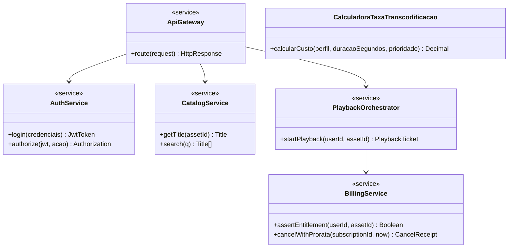

**Verificação** (“estamos construindo o produto corretamente?”) concentra-se nos níveis 1, 2 e 4. **Validação** (“estamos construindo o produto certo?”) concentra-se no nível 3. A cadeia causal da disciplina é **erro (humano) → defeito no artefato → falha observável na execução**.

Notação UML: `+` público, `-` privado, `#` protegido; estereótipos `<<interface>>`, `<<service>>`, `<<Stub>>`, `<<Driver>>`.

---

## 1. Teste de Unidade (Unit Testing)

### 1.1 Verificação de lógica atômica em componente/classe isolada

#### Diagrama de classes UML

**Mermaid**

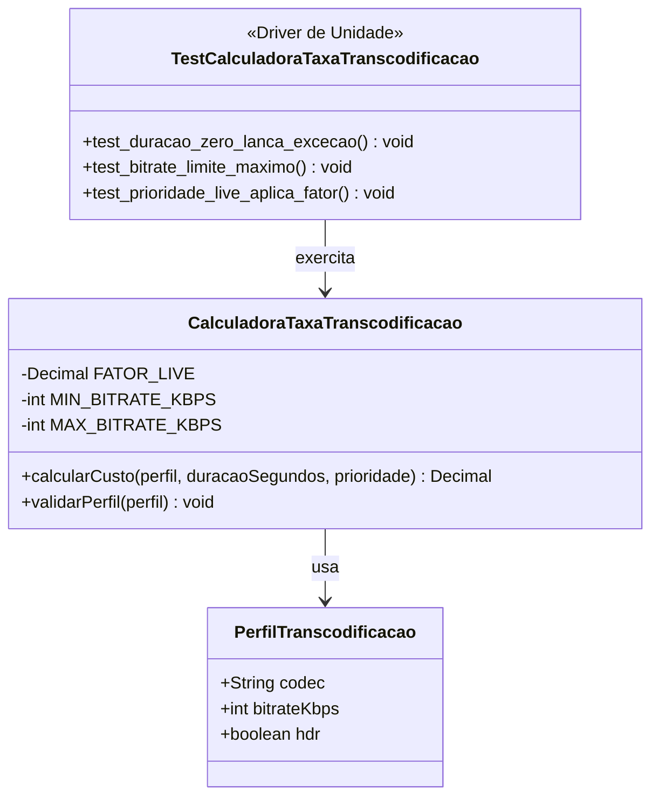

**PlantUML**

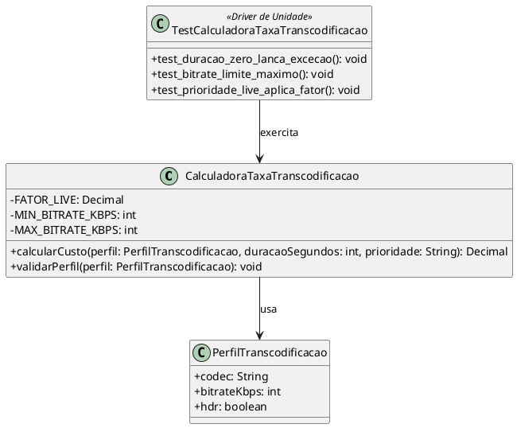

#### Explicação textual

> **Contexto:** No microsserviço de transcodificação, a classe `CalculadoraTaxaTranscodificacao` calcula o custo de um job a partir de `PerfilTranscodificacao` (codec, `bitrateKbps`, `hdr`), da duração em segundos e da prioridade da fila. A regra é atômica: não há Redis, CDN nem gateway. O máximo de bitrate (`MAX_BITRATE_KBPS = 50000`) é inclusivo; duração `<= 0` é inválida; prioridade `LIVE` aplica `FATOR_LIVE = 1.8`.
>
> **Como o teste de unidade é aplicado:**
>
> 1. **Classe real isolada (SUT):** instancia-se apenas `CalculadoraTaxaTranscodificacao`. Não há stubs, porque não existem dependências externas.
> 2. **Driver de unidade:** a classe `TestCalculadoraTaxaTranscodificacao` chama `calcularCusto` e `validarPerfil` com valores-limite: duração `0` (exceção), bitrate `50000` (aceito) versus `50001` (rejeitado), prioridade `LIVE` (fator 1.8).
> 3. **Objetivo e defeitos-alvo:** revelar *off-by-one* no bitrate, operador invertido na duração e fator LIVE não aplicado. O **erro** é ler “até 50 Mbps” como exclusivo; o **defeito** fica no `if`; a **falha** é o job 4K recusado na véspera da estreia.

---

## 2. Teste de Integração (Integration Testing)

### 2.1 Integração não incremental (Big Bang)

#### Diagrama de classes UML

**Mermaid**

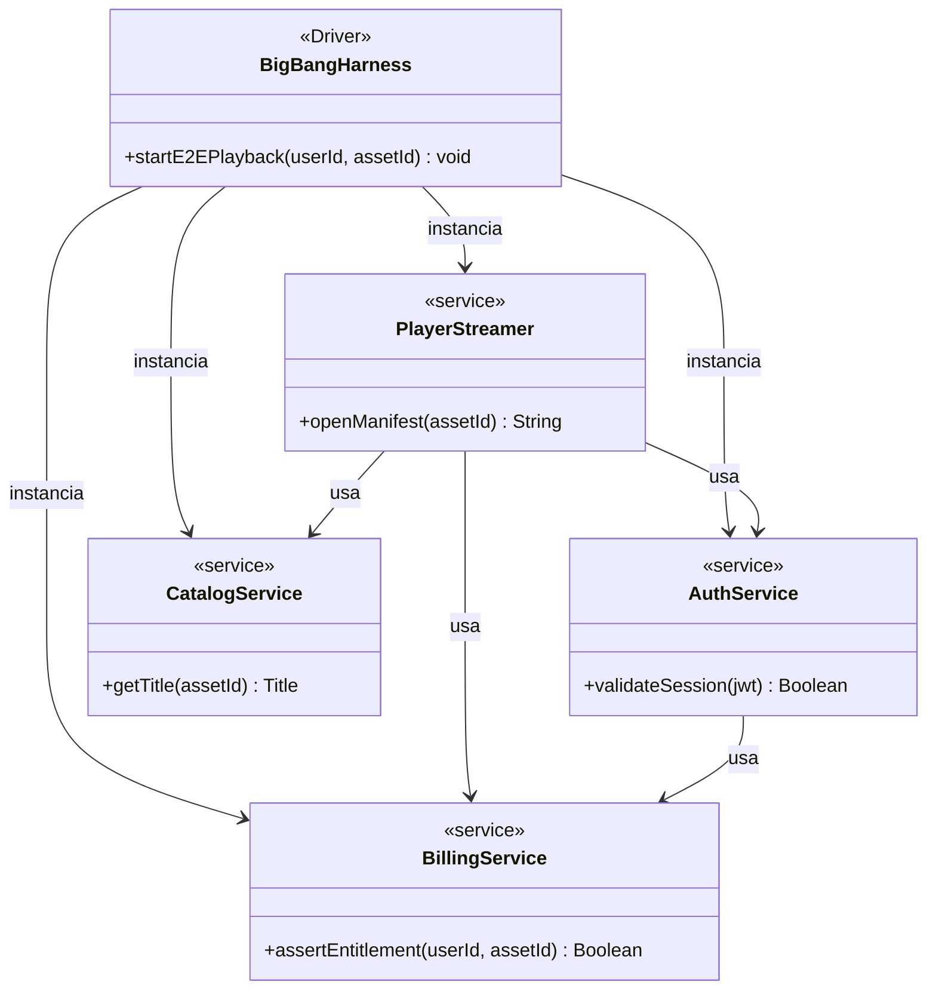

**PlantUML**

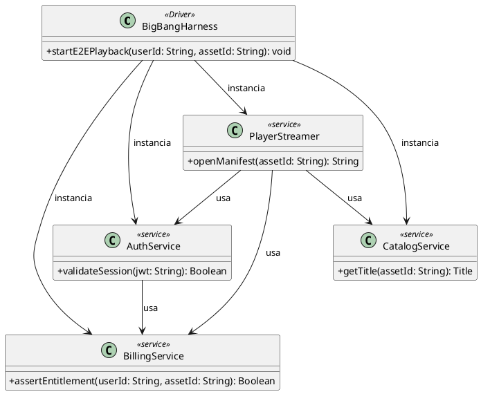

#### Explicação textual

> **Contexto:** O caminho de “play” atravessa `AuthService.validateSession`, `CatalogService.getTitle`, `BillingService.assertEntitlement` e `PlayerStreamer.openManifest`. No Big Bang, o `BigBangHarness.startE2EPlayback` instancia **os quatro módulos reais de uma só vez**, sem stubs e sem ordem incremental.
>
> **Como o Big Bang é aplicado:**
>
> 1. O harness liga Auth, Catálogo, Player e Billing no mesmo teste.
> 2. `PlayerStreamer` depende dos outros três; qualquer contrato quebrado (campo `drmKid` ausente, `userId` versus `user_id`) aparece como HTTP 500 ou entitlement negado.
> 3. **Objetivo e defeitos-alvo:** incompatibilidades de interface e efeitos colaterais entre módulos. O método **não isola causa-raiz**: a falha é barata de ver e cara de diagnosticar. Por isso o Big Bang entra neste estudo como contraponto, não como estratégia recomendada.

### 2.2 Integração incremental Top-Down (descendente) com Stubs

#### Diagrama de classes UML

**Mermaid**

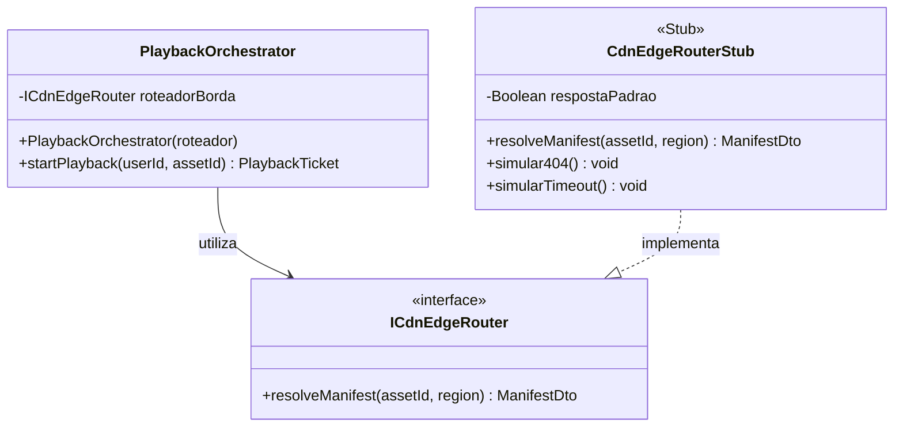

**PlantUML**

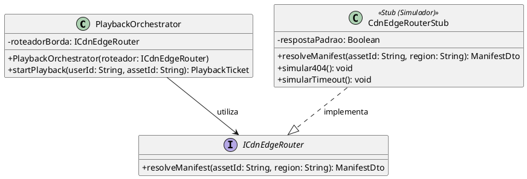

#### Explicação textual

> **Contexto:** O módulo de alto nível `PlaybackOrchestrator` precisa da borda CDN para resolver o master `.m3u8` via `ICdnEdgeRouter.resolveManifest`. A CDN real exige PoPs, DNS e cache — lenta, cara e não determinística no início do incremento.
>
> **Como o Top-Down com stubs é aplicado:**
>
> 1. **Classe real de alto nível sob teste:** `PlaybackOrchestrator` é implementada e testada primeiro, validando `startPlayback(userId, assetId)`.
> 2. **Interface e Stub:** define-se o contrato `ICdnEdgeRouter`. A classe `CdnEdgeRouterStub` simula manifesto com latência, 404 (`simular404()`) ou timeout (`simularTimeout()`), sem acessar a CDN real.
> 3. **Injeção de dependência:** o stub é injetado no construtor `PlaybackOrchestrator(roteador)`. Verifica-se se timeout vira HTTP 503 *retryable* (e não 404) e se a sessão não fica órfã.
> 4. **Avanço na espiral:** quando o conector real for homologado, o stub é substituído por `CdnEdgeRouterReal`.
>
> **Defeitos-alvo:** mapeamento errado de exceção (timeout → 404), DTO com `ttl` em unidade errada e orquestrador acoplado à CDN concreta em vez da interface.

### 2.3 Integração incremental Bottom-Up (ascendente) com Drivers

#### Diagrama de classes UML

**Mermaid**

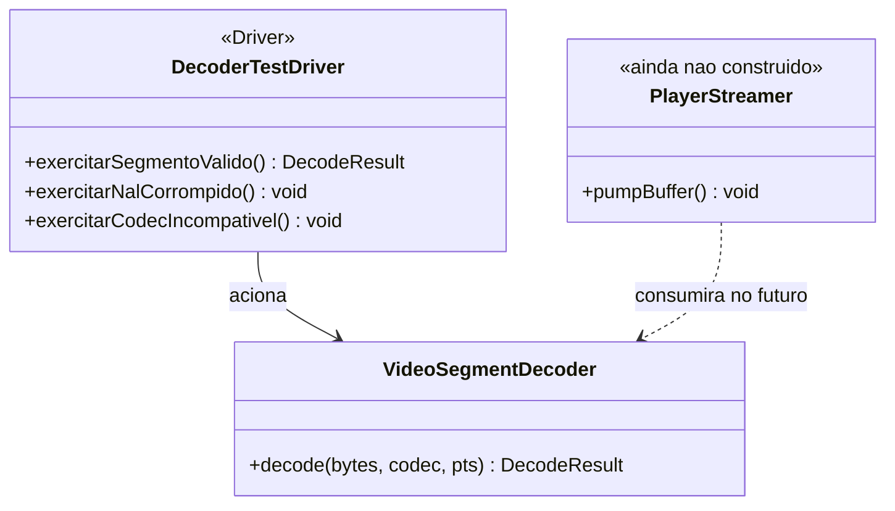

**PlantUML**

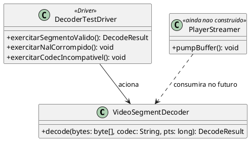

#### Explicação textual

> **Contexto:** `VideoSegmentDecoder.decode(bytes, codec, pts)` é módulo de **baixo nível**. O cliente futuro (`PlayerStreamer.pumpBuffer`) ainda não existe. Sem um driver, o decoder não seria acionado.
>
> **Como o Bottom-Up com drivers é aplicado:**
>
> 1. **Módulo real da base:** `VideoSegmentDecoder` já está implementado.
> 2. **Driver:** `DecoderTestDriver` substitui o player/UI: chama `decode` com segmento H.264 válido, NAL corrompido e codec incompatível.
> 3. **Oráculos:** PTS monotônico no caso feliz; `DecodeException` nos casos ruins — sem estouro de memória.
> 4. Quando `PlayerStreamer` existir, o driver é aposentado e a integração sobe um nível.
>
> **Defeitos-alvo:** crash em bitstream malformado, PTS invertido e silêncio quando o codec não bate com os bytes. **Stub** simula um servidor ainda inexistente (2.2). **Driver** simula um cliente ainda inexistente (2.3). Não se invertem.

### 2.4 Teste de fumaça (Smoke Testing)

#### Diagrama de classes UML

**Mermaid**

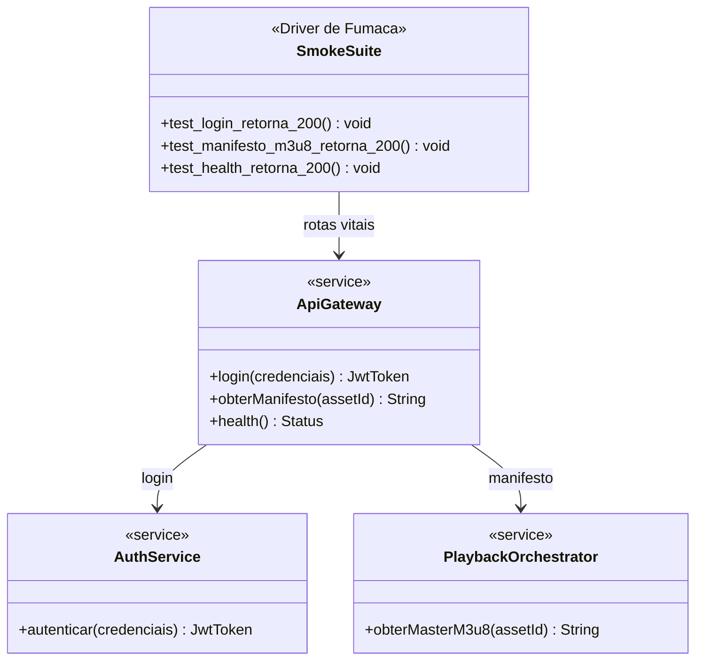

**PlantUML**

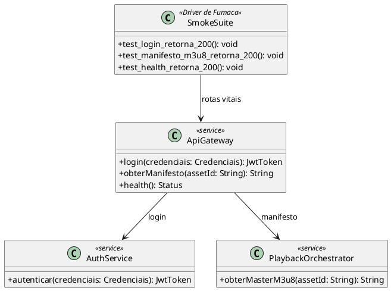

#### Explicação textual

> **Contexto:** A cada build, a `SmokeSuite` pergunta só se o sistema **acende**: login, manifesto `.m3u8` e saúde da API.
>
> **Como o teste de fumaça é aplicado:**
>
> 1. `test_login_retorna_200` chama `ApiGateway.login` → `AuthService.autenticar` e espera HTTP 200 + JWT.
> 2. `test_manifesto_m3u8_retorna_200` chama `obterManifesto` → `PlaybackOrchestrator.obterMasterM3u8` e espera 200 com `#EXT-X-STREAM-INF`.
> 3. `test_health_retorna_200` chama `health()`. Qualquer não-200 aborta o pipeline.
>
> **Objetivo e defeitos-alvo:** build quebrado, login 500, manifesto vazio. Fumaça **não** é teste de sistema nem UAT: não mede p95, não injeta `kill` no Redis e não valida reembolso. É um portão raso para suítes caras.

### 2.5 Teste de regressão

#### Diagrama de classes UML

**Mermaid**

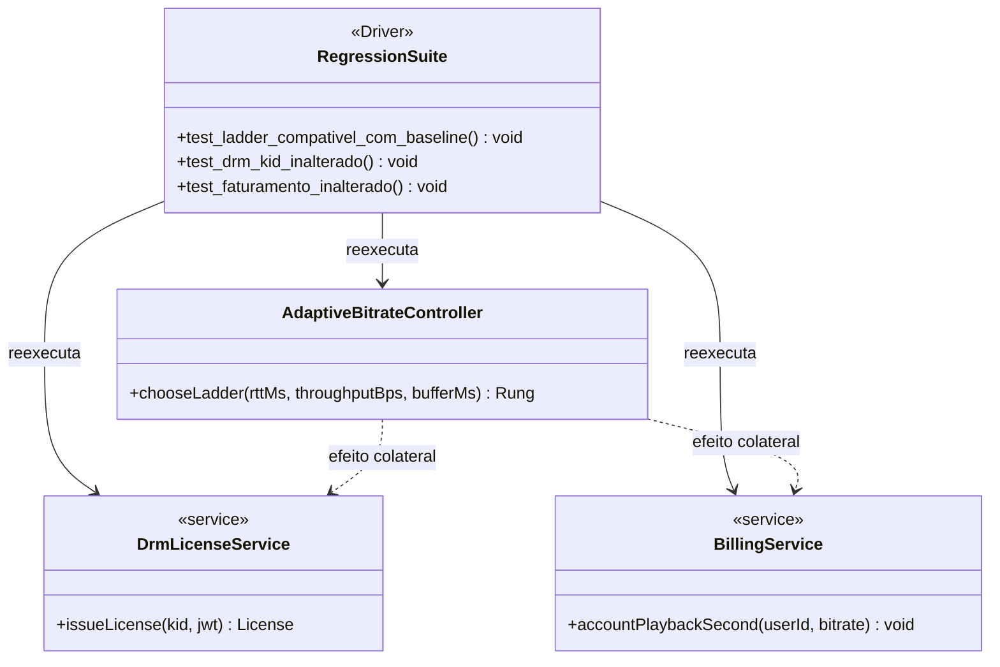

**PlantUML**

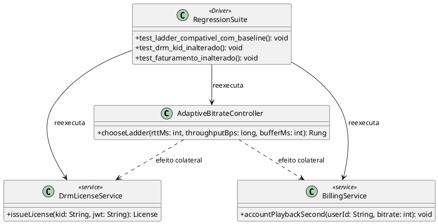

#### Explicação textual

> **Contexto:** Após refatorar `AdaptiveBitrateController.chooseLadder`, a troca de degrau da ladder pode alterar quantas vezes se chama `DrmLicenseService.issueLicense` e qual bitrate entra em `BillingService.accountPlaybackSecond`.
>
> **Como a regressão é aplicada:**
>
> 1. A `RegressionSuite` reexecuta o mesmo vetor de rede da *baseline*.
> 2. `test_ladder_compativel_com_baseline` compara `chooseLadder` ao resultado anterior.
> 3. `test_drm_kid_inalterado` e `test_faturamento_inalterado` protegem DRM e contabilidade — a vizinhança do ABR, não o ABR isolado.
>
> **Defeitos-alvo:** efeito colateral (play “funciona”, fatura muda; KID errado). Regressão responde: *o que já estava verde continua verde?*

---

## 3. Teste de Validação (Validation Testing)

Pergunta de Boehm: **estamos construindo o produto certo?**

### 3.1 Critérios de aceitação (UAT)

#### Diagrama de sequência UML

**Mermaid**

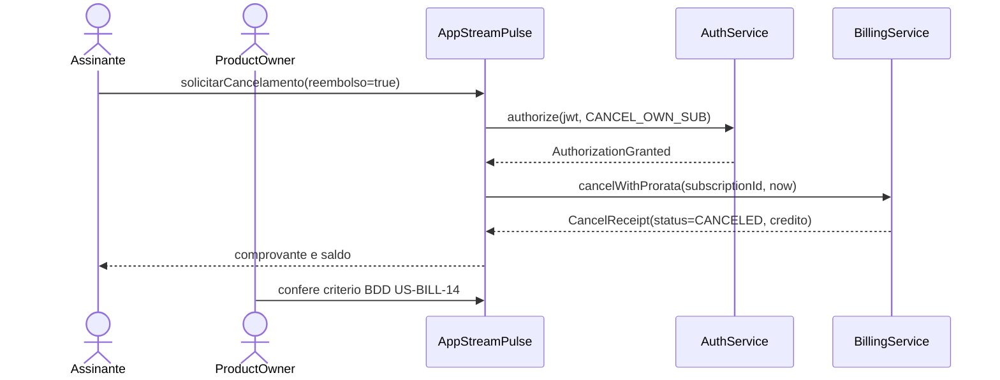

**PlantUML**

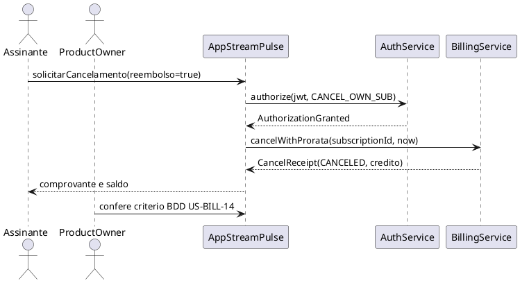

#### Explicação textual

> **Contexto:** História **US-BILL-14**: o titular cancela o plano anual e recebe crédito pro-rata dos dias não usados.
>
> **Como o UAT é aplicado (BDD):**
>
> 1. **Dado** assinatura anual ativa no dia 100/365 e JWT do titular.
> 2. **Quando** `solicitarCancelamento(reembolso=true)` e `AuthService.authorize(jwt, CANCEL_OWN_SUB)` concede.
> 3. **Então** `BillingService.cancelWithProrata` devolve `CancelReceipt(status=CANCELED)` com `crédito = round(precoAnual * 265/365)` e o comprovante aparece no app. O **Product Owner** aceita ou rejeita o critério.
>
> **Defeitos-alvo:** produto errado (usuário queria *pausar*, não cancelar), crédito invisível, cancelar conta de terceiros se `CANCEL_OWN_SUB` estiver frouxo. Unidade pode verificar a fórmula; UAT valida se o comprovante que o titular vê é o combinado com o negócio.

### 3.2 Teste Alfa (Alpha Testing)

#### Diagrama de classes UML

**Mermaid**

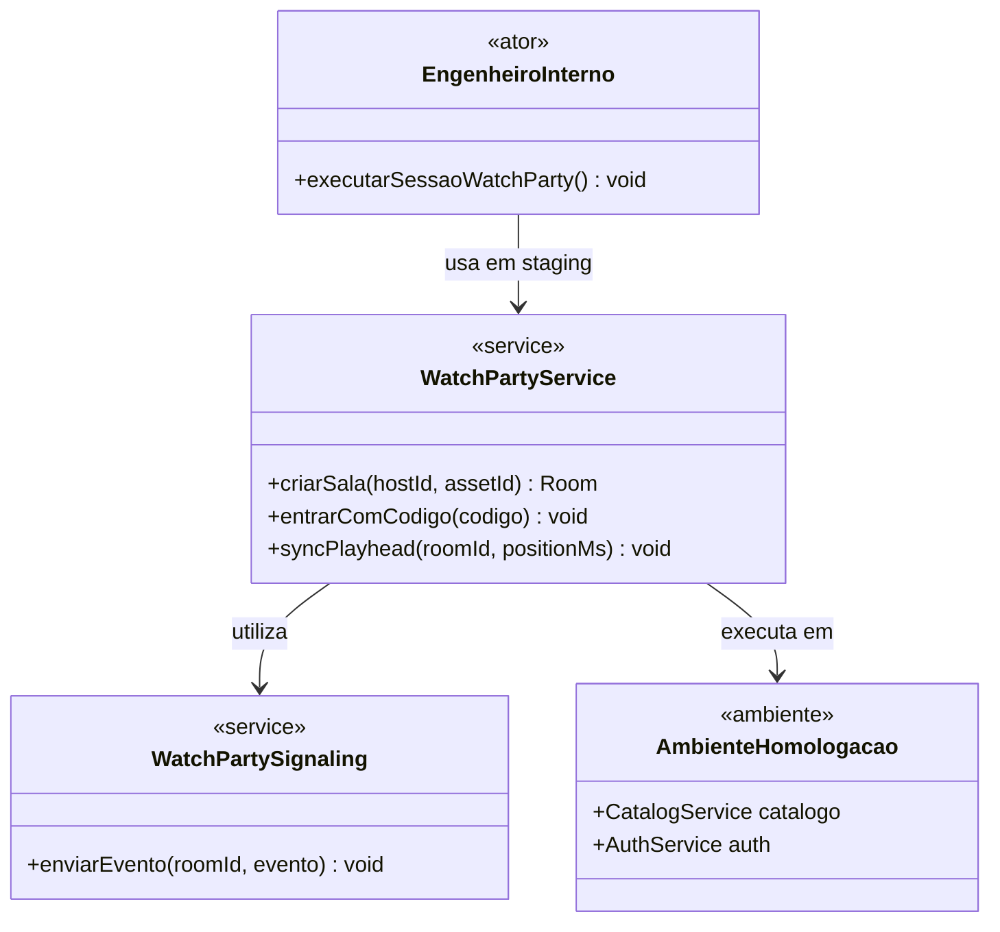

**PlantUML**

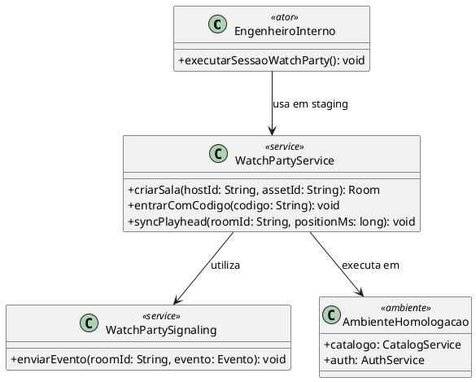

#### Explicação textual

> **Contexto:** O módulo “Assista em Grupo” (`WatchPartyService` + `WatchPartySignaling`) é novo. APIs verdes não garantem que o produto seja usável na TV.
>
> **Como o Alfa é aplicado:**
>
> 1. **Atores internos** (`EngenheiroInterno`, QA, Product) usam **apenas** `AmbienteHomologacao`.
> 2. Exercitam `criarSala`, `entrarComCodigo` e `syncPlayhead`.
> 3. A saída é go/no-go para o Beta, não um SLO de produção.
>
> **Defeitos-alvo:** código de sala ilegível na Smart TV, *drift* de `syncPlayhead`, sala sem autorização. Alfa **não** é Beta: não há usuário final nem rede doméstica.

### 3.3 Teste Beta (Beta Testing)

#### Diagrama de classes UML

**Mermaid**

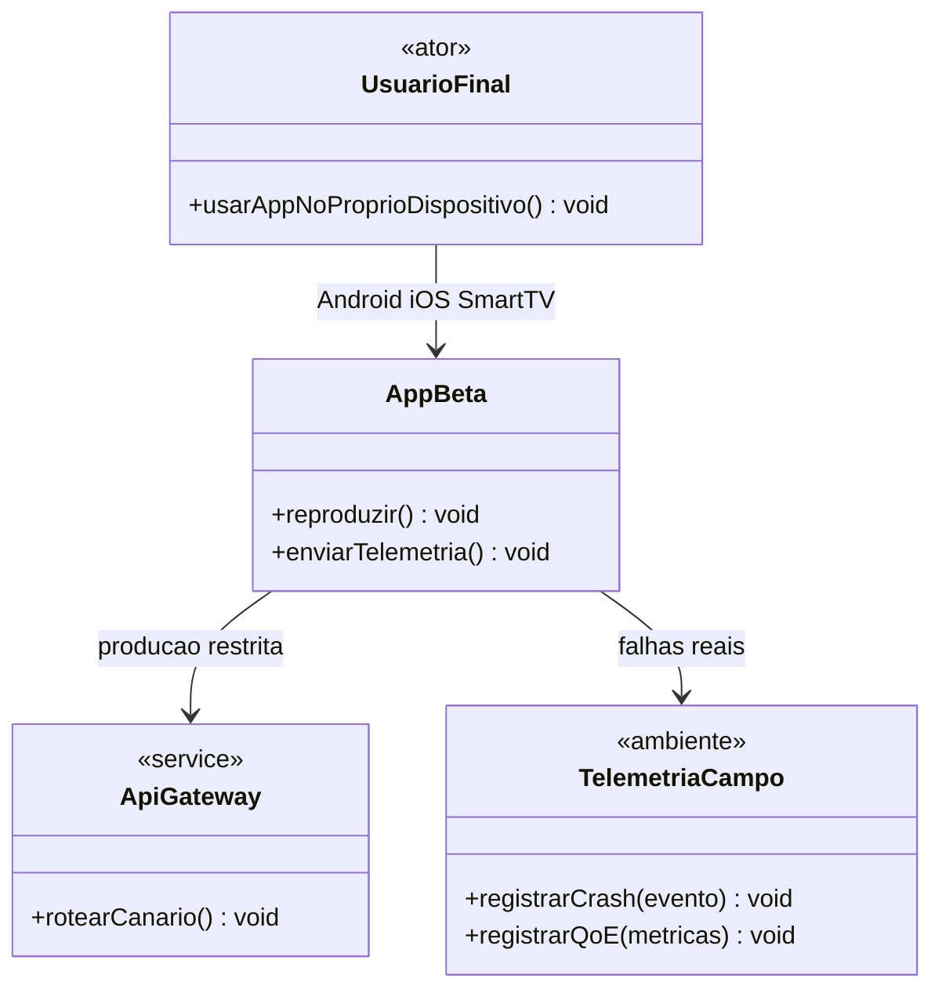

**PlantUML**

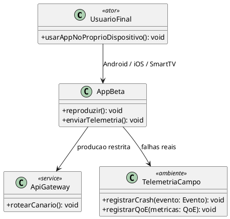

#### Explicação textual

> **Contexto:** Cerca de 1.000 usuários reais recebem o `AppBeta` (TestFlight / Play Internal / firmware de TV) e usam o app **no próprio dispositivo**.
>
> **Como o Beta é aplicado:**
>
> 1. `UsuarioFinal` executa `usarAppNoProprioDispositivo` em Android, iOS ou Smart TV.
> 2. `AppBeta` fala com `ApiGateway.rotearCanario` (produção restrita) e envia falhas para `TelemetriaCampo.registrarCrash` / `registrarQoE`.
> 3. O ambiente **não é controlado** (NAT, DRM do fabricante, 4G).
>
> **Defeitos-alvo:** crash em SoC de TV, Widevine L3, *clock skew*. Telemetria de campo **não** substitui o critério de aceite do UAT: mil usuários podem “gostar” de um reembolso juridicamente errado.

---

## 4. Teste de Sistema (System Testing)

O software é exercitado com infraestrutura, rede e operadores.

### 4.1 Teste de recuperação (Recovery Testing)

#### Diagrama de sequência UML

**Mermaid**

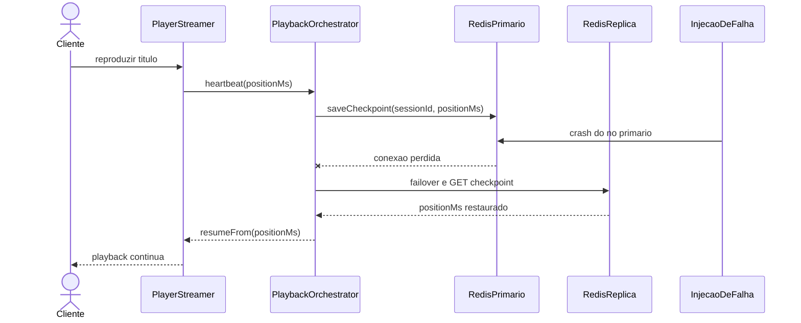

**PlantUML**

```plantuml
@startuml
actor Cliente
participant PlayerStreamer
participant PlaybackOrchestrator
participant RedisPrimario
participant RedisReplica
participant InjecaoDeFalha

Cliente -> PlayerStreamer : reproduzir titulo
PlayerStreamer -> PlaybackOrchestrator : heartbeat(positionMs)
PlaybackOrchestrator -> RedisPrimario : saveCheckpoint(sessionId, positionMs)
InjecaoDeFalha -> RedisPrimario : crash do no primario
RedisPrimario --x PlaybackOrchestrator : conexao perdida
PlaybackOrchestrator -> RedisReplica : failover e GET checkpoint
RedisReplica --> PlaybackOrchestrator : positionMs restaurado
PlaybackOrchestrator --> PlayerStreamer : resumeFrom(positionMs)
PlayerStreamer --> Cliente : playback continua
@enduml
```

#### Explicação textual

> **Contexto:** O ponto da reprodução vive em Redis (`saveCheckpoint`). Sem failover, o crash do primário **reinicia o episódio**.
>
> **Como a recuperação é aplicada:**
>
> 1. Cliente reproduz; `PlayerStreamer` envia `heartbeat(positionMs)` ao `PlaybackOrchestrator`, que grava no `RedisPrimario`.
> 2. `InjecaoDeFalha` derruba o primário (crash / `kill` do processo).
> 3. O orquestrador faz failover para `RedisReplica`, lê o checkpoint e chama `resumeFrom(positionMs)`.
> 4. Oráculo: o cliente **não** volta ao início; o serviço continua.
>
> **Defeitos-alvo:** falha de failover, checkpoint só na memória do primário, retomada no byte 0.

### 4.2 Teste de segurança (Security Testing)

#### Diagrama de sequência UML

**Mermaid**

```mermaid
sequenceDiagram
    actor Atacante
    participant GW as ApiGateway
    participant JWT as TokenJwtValidator
    participant CAT as CatalogService

    Atacante->>GW: GET /catalog com JWT expirado
    GW->>JWT: validate(token)
    JWT-->>GW: TokenExpiredException
    GW-->>Atacante: HTTP 401

    Atacante->>GW: GET /admin com JWT manipulado
    GW->>JWT: validate(token)
    JWT-->>GW: InvalidSignatureException
    GW-->>Atacante: HTTP 401

    Atacante->>GW: GET /catalog/search?q=payload
    GW->>CAT: search(q sanitizado)
    CAT-->>Atacante: lista vazia ou HTTP 400
```

**PlantUML**

```plantuml
@startuml
actor Atacante
participant ApiGateway
participant TokenJwtValidator
participant CatalogService

Atacante -> ApiGateway : GET /catalog com JWT expirado
ApiGateway -> TokenJwtValidator : validate(token)
TokenJwtValidator --> ApiGateway : TokenExpiredException
ApiGateway --> Atacante : HTTP 401

Atacante -> ApiGateway : GET /admin com JWT manipulado
ApiGateway -> TokenJwtValidator : validate(token)
TokenJwtValidator --> ApiGateway : InvalidSignatureException
ApiGateway --> Atacante : HTTP 401

Atacante -> ApiGateway : GET /catalog/search?q=payload
ApiGateway -> CatalogService : search(q sanitizado)
CatalogService --> Atacante : lista vazia ou HTTP 400
@enduml
```

#### Explicação textual

> **Contexto:** A superfície é o `ApiGateway`. `TokenJwtValidator.validate` verifica expiração e assinatura. `CatalogService.search` não deve interpolar `q` na consulta.
>
> **Como o teste de segurança é aplicado:**
>
> 1. JWT expirado → `TokenExpiredException` → HTTP 401.
> 2. JWT com *claim* adulterada sem nova assinatura → `InvalidSignatureException` → HTTP 401 em rota administrativa.
> 3. Busca com payload de injeção → `search` sanitizado → 400 ou lista vazia, sem dump do catálogo.
>
> **Defeitos-alvo:** quebra de autenticação, quebra de autorização e injeção na busca. Um 401 nesses três casos **reduz risco**; não prova software inviolável.

### 4.3 Teste de estresse (Stress Testing)

#### Diagrama de classes UML

**Mermaid**

```mermaid
classDiagram
    class GeradorEstresse {
        <<Driver de Carga>>
        +simularEstreia(vu) void
    }

    class ApiGateway {
        <<service>>
        +receberRequisicao() HttpResponse
    }

    class CircuitBreaker {
        +permitir() Boolean
        +abrir() void
        +rejeitarRapido() HttpResponse
    }

    class PlaybackOrchestrator {
        <<service>>
        +startPlayback(userId, assetId) PlaybackTicket
    }

    GeradorEstresse --> ApiGateway : 500000 VU
    ApiGateway --> CircuitBreaker : consulta
    CircuitBreaker --> PlaybackOrchestrator : se fechado
    CircuitBreaker --> GeradorEstresse : 429 ou 503 se aberto
```

**PlantUML**

```plantuml
@startuml
skinparam classAttributeIconSize 0

class GeradorEstresse <<Driver de Carga>> {
  + simularEstreia(vu: int): void
}

class ApiGateway <<service>> {
  + receberRequisicao(): HttpResponse
}

class CircuitBreaker {
  + permitir(): Boolean
  + abrir(): void
  + rejeitarRapido(): HttpResponse
}

class PlaybackOrchestrator <<service>> {
  + startPlayback(userId: String, assetId: String): PlaybackTicket
}

GeradorEstresse --> ApiGateway : 500000 VU
ApiGateway --> CircuitBreaker : consulta
CircuitBreaker --> PlaybackOrchestrator : se fechado
CircuitBreaker --> GeradorEstresse : 429 ou 503 se aberto
@enduml
```

#### Explicação textual

> **Contexto:** Na estreia, o `GeradorEstresse.simularEstreia` aplica 500.000 usuários virtuais — acima da capacidade nominal de 100.000 req/s.
>
> **Como o estresse é aplicado:**
>
> 1. As requisições entram no `ApiGateway`, que consulta o `CircuitBreaker`.
> 2. Se fechado, segue para `PlaybackOrchestrator.startPlayback`.
> 3. Se o erro passa do limiar, `abrir()` e `rejeitarRapido()` devolvem 429/503. Degradação aceitável; OOM/deadlock não.
>
> **Defeitos-alvo:** ausência de *backpressure*, breaker que nunca abre, perda de eventos de billing. Estresse pergunta o que acontece **além** da capacidade — não se confunde com desempenho (4.4).

### 4.4 Teste de desempenho (Performance Testing)

#### Diagrama de classes UML

**Mermaid**

```mermaid
classDiagram
    class GeradorCargaEstavel {
        <<Driver de Carga>>
        +executarPerfilNominal() void
    }

    class ApiGateway {
        <<service>>
        +obterManifesto(assetId) String
    }

    class ServicoManifesto {
        <<service>>
        +montarMasterM3u8(assetId) String
    }

    class CdnEntregaChunks {
        <<service>>
        +entregarChunk(url) byte[]
    }

    GeradorCargaEstavel --> ApiGateway : 80 por cento da capacidade
    ApiGateway --> ServicoManifesto : p95 p99
    GeradorCargaEstavel --> CdnEntregaChunks : vazao de chunks
```

**PlantUML**

```plantuml
@startuml
skinparam classAttributeIconSize 0

class GeradorCargaEstavel <<Driver de Carga>> {
  + executarPerfilNominal(): void
}

class ApiGateway <<service>> {
  + obterManifesto(assetId: String): String
}

class ServicoManifesto <<service>> {
  + montarMasterM3u8(assetId: String): String
}

class CdnEntregaChunks <<service>> {
  + entregarChunk(url: String): byte[]
}

GeradorCargaEstavel --> ApiGateway : 80% da capacidade
ApiGateway --> ServicoManifesto : p95 / p99
GeradorCargaEstavel --> CdnEntregaChunks : vazao de chunks
@enduml
```

#### Explicação textual

> **Contexto:** Fora da estreia, a operação vive em cerca de 80% da capacidade. O SLO de manifesto é p95 e p99 abaixo de 200 ms; a CDN deve sustentar vazão de chunks.
>
> **Como o desempenho é aplicado:**
>
> 1. `GeradorCargaEstavel.executarPerfilNominal` gera carga **contínua**, não pico de 500k.
> 2. Mede-se latência de `ApiGateway.obterManifesto` → `ServicoManifesto.montarMasterM3u8`.
> 3. Mede-se vazão de `CdnEntregaChunks.entregarChunk`.
>
> **Defeitos-alvo:** p99 estourado com p50 bonito (cauda), N+1 no catálogo, PoP subdimensionado. Desempenho mede o **envelope nominal**; estresse (4.3) mede o que acontece **fora** dele.

---

## Síntese para arguição

| ID | Diagrama | Papel-chave | Não confundir com |
| --- | --- | --- | --- |
| 1.1 | Classes | SUT isolado + driver de unidade | integração (não há I/O) |
| 2.1 | Classes | quatro módulos reais de uma vez | teste de sistema |
| 2.2 | Classes | **Stub** no lugar da CDN | driver |
| 2.3 | Classes | **Driver** no lugar do player | stub |
| 2.4 | Classes | três rotas vitais | UAT / carga |
| 2.5 | Classes | vizinhança DRM/billing após refatorar ABR | só retestar o ABR |
| 3.1 | Sequência | PO + BDD | verificação da fórmula |
| 3.2 | Classes | internos em homologação | Beta |
| 3.3 | Classes | usuário real no próprio aparelho | Alfa |
| 4.1 | Sequência | injeção de crash no Redis | unidade do SessionStore |
| 4.2 | Sequência | JWT / busca | prova de segurança absoluta |
| 4.3 | Classes | 500k VU + circuit breaker | desempenho |
| 4.4 | Classes | carga estável + p95/p99 | estresse |

**Stub** = substitui um *servidor* ainda não pronto (Top-Down). **Driver** = substitui um *cliente* ainda não pronto (Bottom-Up).

---

## Checklist da atividade

- [x] 13 abordagens no domínio StreamPulse
- [x] UML (classes ou sequência), com módulos reais, stubs, drivers, atores e injeção de falha identificados
- [x] Texto referenciando classes, métodos e mensagens do diagrama
- [x] Stub em 2.2 e Driver em 2.3, sem inversão
- [x] Mermaid (renderização no GitHub) e PlantUML (mesmo modelo do exemplo Pix)

---

## Referências

1. Pressman, R. S.; Maxim, B. R. *Engenharia de software: uma abordagem profissional*. 8. ed. Porto Alegre: AMGH, 2016.
2. Amaral, M. Apostila VVTS e [Modelagem com Diagramas de Classes UML](https://maxwellamaral.github.io/lessons/softeng/design/uml_classes/).
3. [Mermaid](https://mermaid.js.org/) · [Mermaid Live Editor](https://mermaid.live/)
4. [PlantUML](https://plantuml.com/) · [PlantText](https://www.planttext.com/)
