# Sistema de Atendimento e Prospecção

- **Disciplina:** Verificação, Validação e Teste de Software
- **Atividade:** Laboratório 02 — estratégias e níveis de teste
- **Setor estudado:** prospecção
- **Função escolhida:** registrar o resultado de uma tentativa de contato

Este trabalho usa somente um recorte do sistema: o operador recebe um contato da fila, informa o canal utilizado, registra o resultado e conclui a tentativa. O mesmo fluxo aparece em todos os testes para tornar a explicação mais simples.

Os diagramas são exibidos pelo GitHub em Mermaid. A pasta [`diagramas/`](diagramas/) também contém a mesma representação em PlantUML. Os prompts usados na elaboração estão em [`prompts_utilizados.md`](prompts_utilizados.md).

---

## 1. Visão simples da função escolhida

### Regras principais

1. O contato precisa estar reservado para o operador.
2. Todo canal marcado como usado precisa ter um resultado.
3. Cada tentativa cria um novo registro no histórico; um registro anterior não é sobrescrito.
4. Se nenhum desfecho for escolhido, o contato volta para a fila.
5. Se houver um desfecho, a situação do contato é atualizada.
6. Se ocorrer uma falha antes da gravação terminar, a operação é desfeita e os dados continuam visíveis na tela.

### Fluxo principal

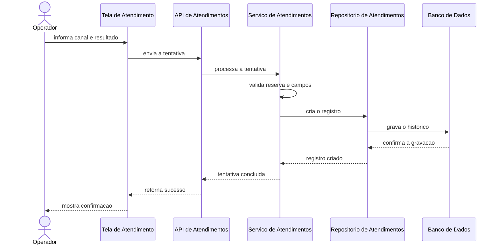

### Componentes usados nos diagramas

| Componente | Responsabilidade |
| --- | --- |
| `TelaDeAtendimento` | Receber os dados informados pelo operador. |
| `ApiDeAtendimentos` | Receber a requisição de registro. |
| `ServicoDeAtendimentos` | Validar e coordenar as regras. |
| `RepositorioDeAtendimentos` | Ler e gravar os dados. |
| `BancoDeDados` | Guardar contatos e histórico de tentativas. |

### Correspondência com o sistema existente

O recorte não foi inventado. Ele foi simplificado a partir destes elementos já existentes no sistema:

| No trabalho | No sistema existente |
| --- | --- |
| Concluir a tentativa na tela | função `concluir` da tela de atendimento |
| Enviar a tentativa | rota `POST /pessoas/:id/atendimento` |
| Validar e coordenar | funções `processarAtendimento`, `validarAtendimentoAtual` e `validarCanaisUsados` |
| Classificar o resultado | função `classificarResultado` |
| Gravar no histórico | função `criarAtendimento` e tabela `atendimentos` |

---

## 2. Teste de unidade

O teste de unidade verifica uma função pequena e isolada. Aqui, a função `classificarResultado` recebe o resultado da tentativa e devolve uma classificação.

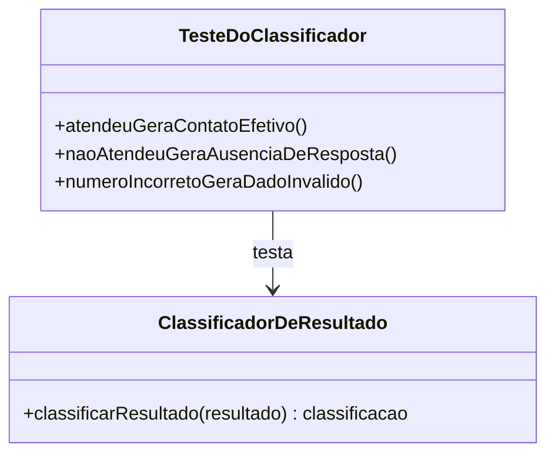

Casos simples:

| Entrada | Resultado esperado |
| --- | --- |
| `ATENDEU` | `CONTATO_EFETIVO` |
| `NAO_ATENDEU` | `AUSENCIA_RESPOSTA` |
| `NUMERO_INCORRETO` | `CANAL_DADO_INVALIDO` |

O banco, a tela e a API não participam. Se o teste falhar, o defeito está na regra de classificação. Fontes: [`Mermaid`](diagramas/1.1-unidade-classificacao-resultado.mmd) e [`PlantUML`](diagramas/1.1-unidade-classificacao-resultado.puml).

---

## 3. Testes de integração

O teste de integração verifica se componentes diferentes conseguem trabalhar juntos.

### 3.1 Integração não incremental (Big Bang)

Todos os componentes reais são ligados de uma só vez.

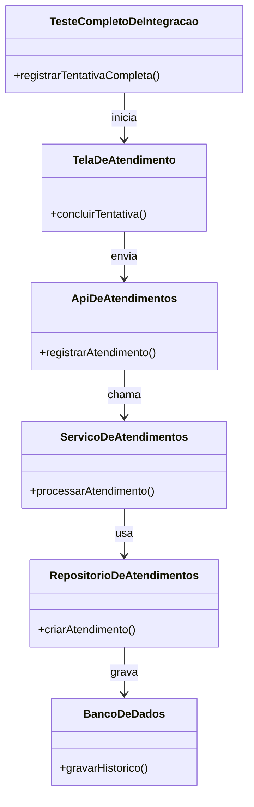

Vantagem: mostra rapidamente se o fluxo completo funciona. Desvantagem: quando falha, é mais difícil descobrir qual componente causou o problema. Fontes: [`Mermaid`](diagramas/2.1-integracao-nao-incremental.mmd) e [`PlantUML`](diagramas/2.1-integracao-nao-incremental.puml).

### 3.2 Integração descendente com simulador (Top-Down com Stub)

O teste começa pelos componentes de cima. Neste teste, o repositório real não é usado; um simulador devolve respostas controladas.

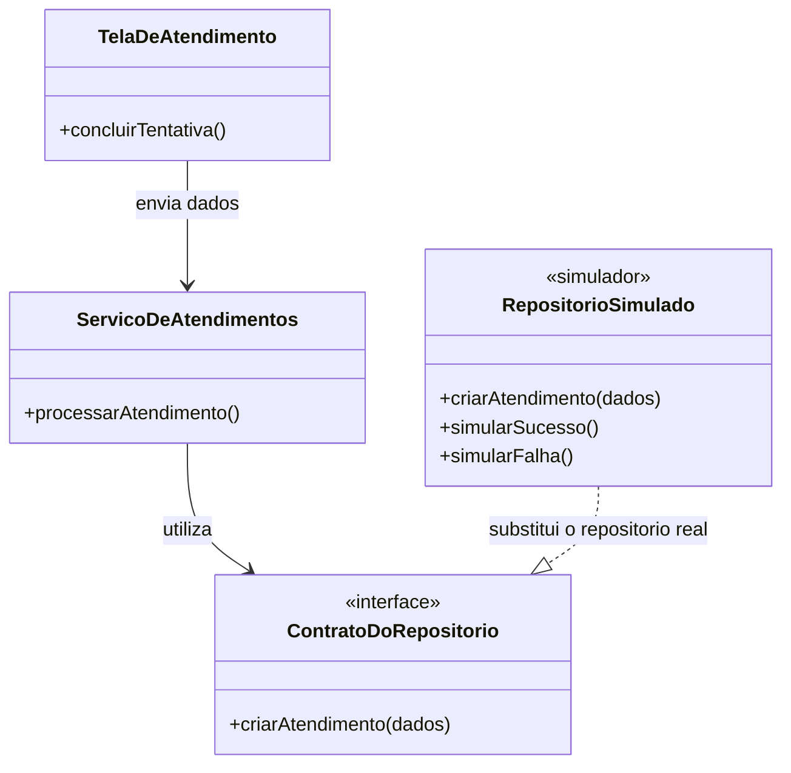

O simulador permite verificar se a tela mantém os campos quando a gravação falha. Ele substitui uma dependência de baixo nível. Fontes: [`Mermaid`](diagramas/2.2-integracao-descendente-simulador.mmd) e [`PlantUML`](diagramas/2.2-integracao-descendente-simulador.puml).

### 3.3 Integração ascendente com acionador (Bottom-Up com Driver)

O teste começa pelos componentes de baixo. Um acionador de teste chama o repositório diretamente, sem depender da tela.

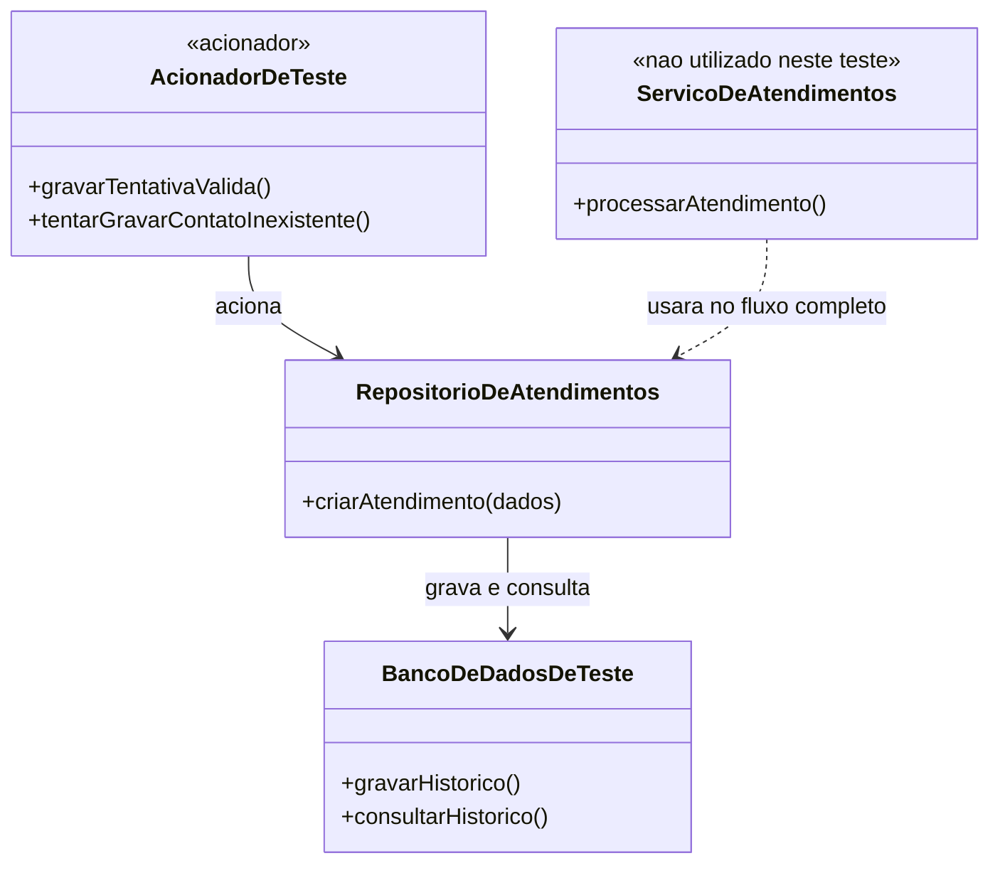

O acionador substitui temporariamente o componente que chamaria o repositório. Assim, a gravação e a leitura do histórico são verificadas primeiro. Fontes: [`Mermaid`](diagramas/2.3-integracao-ascendente-acionador.mmd) e [`PlantUML`](diagramas/2.3-integracao-ascendente-acionador.puml).

### 3.4 Teste de fumaça

É uma verificação curta para saber se as partes essenciais estão funcionando.

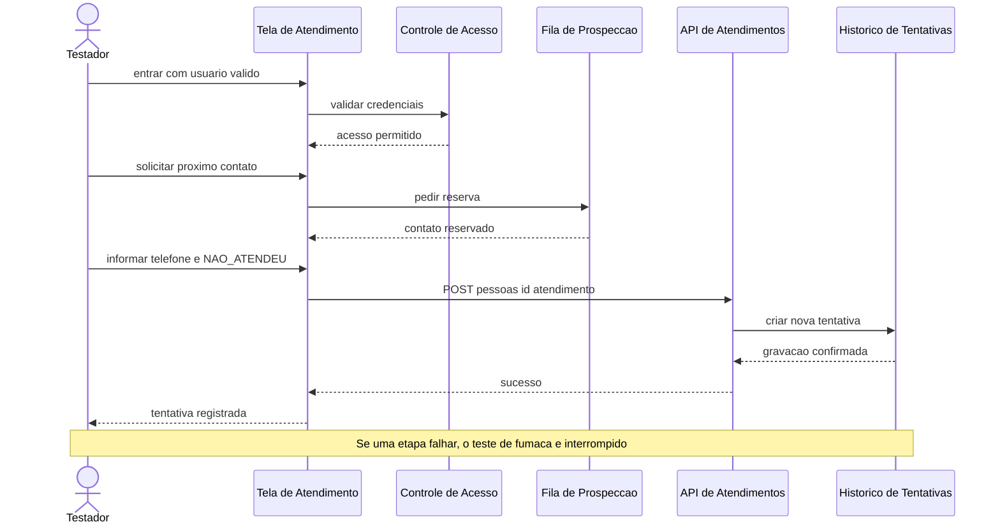

O roteiro confirma o caminho crítico mínimo: autenticar, reservar um contato e gravar uma tentativa no histórico. O resultado esperado é uma confirmação de sucesso em todas as etapas. Qualquer falha interrompe o teste e impede o início das suítes mais demoradas. O teste de fumaça não verifica todas as variações das regras. Fontes: [`Mermaid`](diagramas/2.4-teste-fumaca.mmd) e [`PlantUML`](diagramas/2.4-teste-fumaca.puml).

### 3.5 Teste de regressão

Depois de uma alteração, os testes antigos são executados novamente para confirmar que algo já funcionando não foi quebrado.

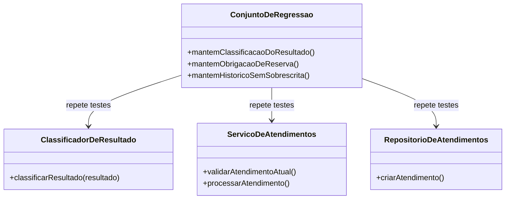

Exemplo: depois de mudar a tela, ainda deve ser impossível registrar um contato reservado para outro operador. Fontes: [`Mermaid`](diagramas/2.5-teste-regressao.mmd) e [`PlantUML`](diagramas/2.5-teste-regressao.puml).

---

## 4. Testes de validação

Os testes de validação observam se a função atende à necessidade de quem a utiliza. A aprovação depende de avaliação humana.

### 4.1 Teste de aceitação do usuário

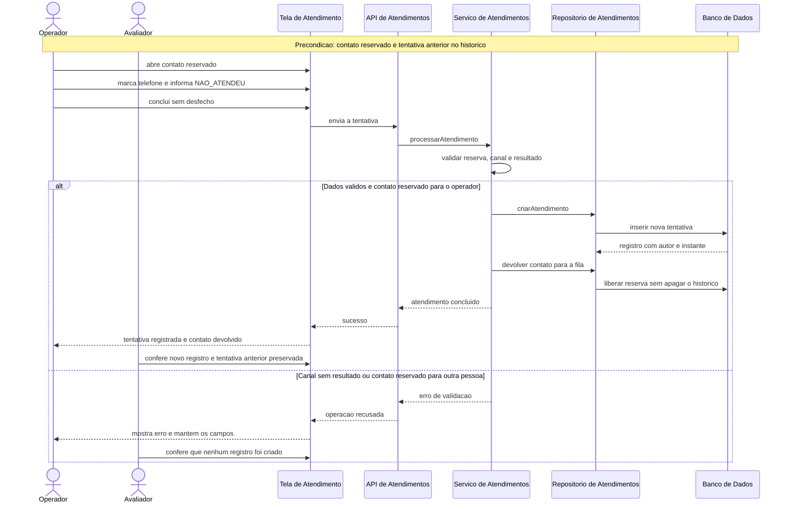

Critérios em linguagem simples:

- **Dado** um contato reservado para o operador e uma tentativa anterior no histórico;
- **Quando** ele registra que a ligação não foi atendida, sem escolher desfecho;
- **Então** uma nova tentativa, com autor e instante, deve entrar no histórico, a tentativa anterior deve permanecer e o contato deve voltar para a fila;
- **E**, se faltar o resultado do canal ou o contato pertencer a outro operador, a operação deve ser recusada sem criar registro.

O diagrama cobre o caminho válido e uma recusa esperada. O aceite só existe quando o avaliador humano executar os cenários e confirmar os resultados. Fontes: [`Mermaid`](diagramas/3.1-teste-aceitacao.mmd) e [`PlantUML`](diagramas/3.1-teste-aceitacao.puml).

### 4.2 Teste Alfa

O teste Alfa é realizado internamente, em ambiente de homologação, antes de liberar a função para usuários convidados.

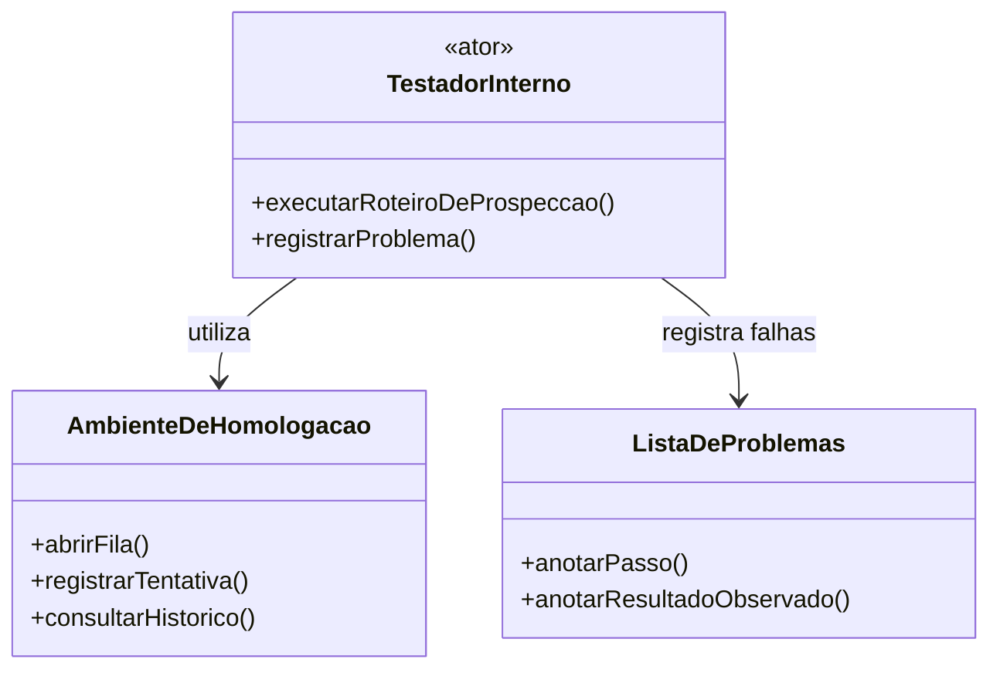

O foco é encontrar problemas de uso, como mensagem confusa, botão que não desabilita durante a gravação ou dificuldade para entender o próximo passo. Fontes: [`Mermaid`](diagramas/3.2-teste-alfa.mmd) e [`PlantUML`](diagramas/3.2-teste-alfa.puml).

### 4.3 Teste Beta

O teste Beta entrega a função para um grupo pequeno de operadores convidados, em uso real controlado.

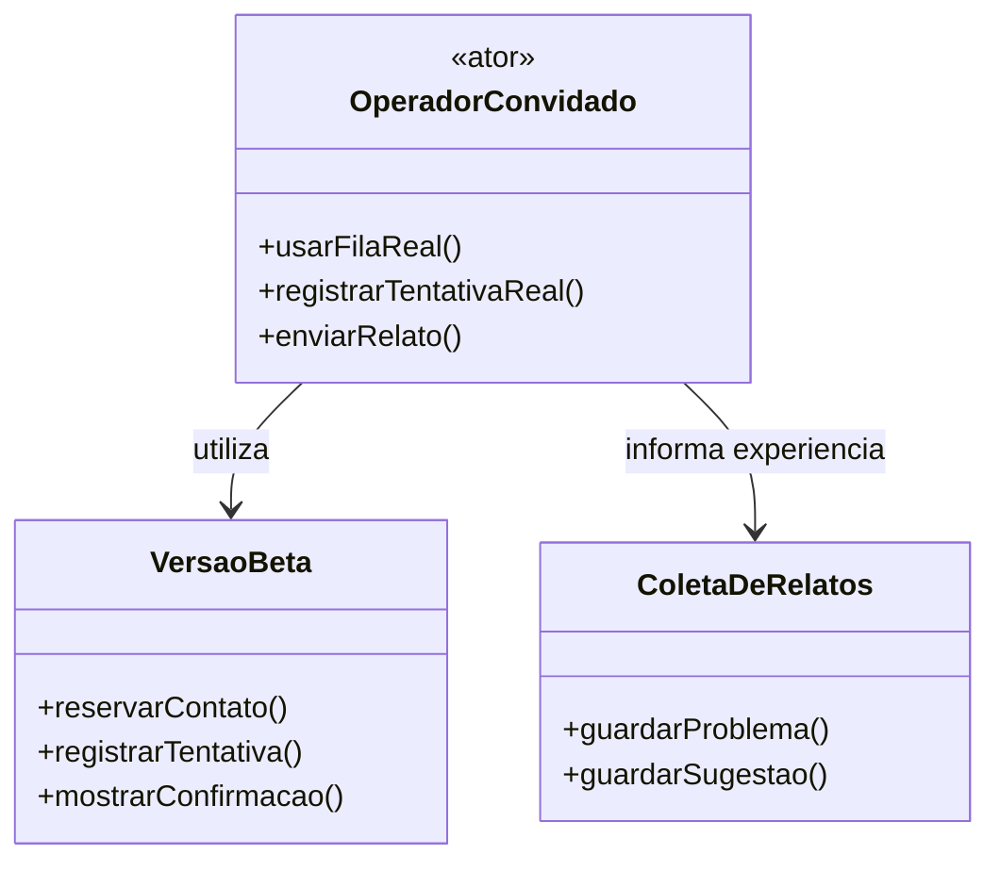

A diferença é simples: no Alfa, a equipe interna testa em homologação; no Beta, convidados usam uma versão controlada em situação real. A conclusão também depende de retorno humano. Fontes: [`Mermaid`](diagramas/3.3-teste-beta.mmd) e [`PlantUML`](diagramas/3.3-teste-beta.puml).

---

## 5. Testes de sistema

O teste de sistema observa a aplicação completa em condições próximas do uso real.

### 5.1 Teste de recuperação

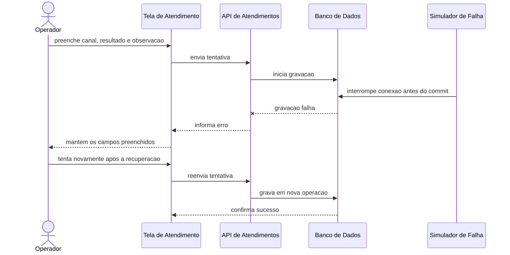

O teste simula uma falha confirmada antes do commit. Ele confirma duas coisas: nenhuma gravação incompleta permanece e o operador não perde o que digitou. Só depois dessa confirmação o operador tenta novamente. Fontes: [`Mermaid`](diagramas/4.1-recuperacao.mmd) e [`PlantUML`](diagramas/4.1-recuperacao.puml).

### 5.2 Teste de segurança

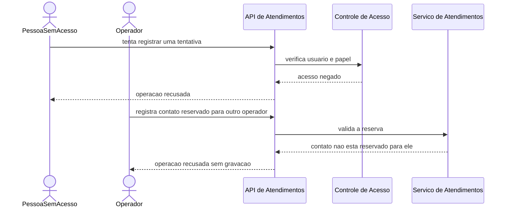

O objetivo é impedir registros por pessoa sem acesso e alterações em contato reservado para outro operador. O teste não prova segurança absoluta; ele verifica essas duas regras do recorte. Fontes: [`Mermaid`](diagramas/4.2-seguranca.mmd) e [`PlantUML`](diagramas/4.2-seguranca.puml).

### 5.3 Teste de estresse

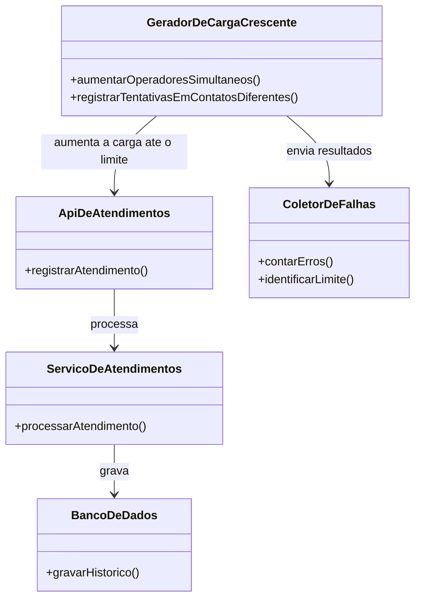

A quantidade de operações cresce até o sistema ficar lento ou começar a recusar requisições. O objetivo é descobrir o limite e observar se a aplicação falha de maneira controlada. Não foi inventado um número de usuários, pois esse limite precisa ser medido. Fontes: [`Mermaid`](diagramas/4.3-estresse.mmd) e [`PlantUML`](diagramas/4.3-estresse.puml).

### 5.4 Teste de desempenho

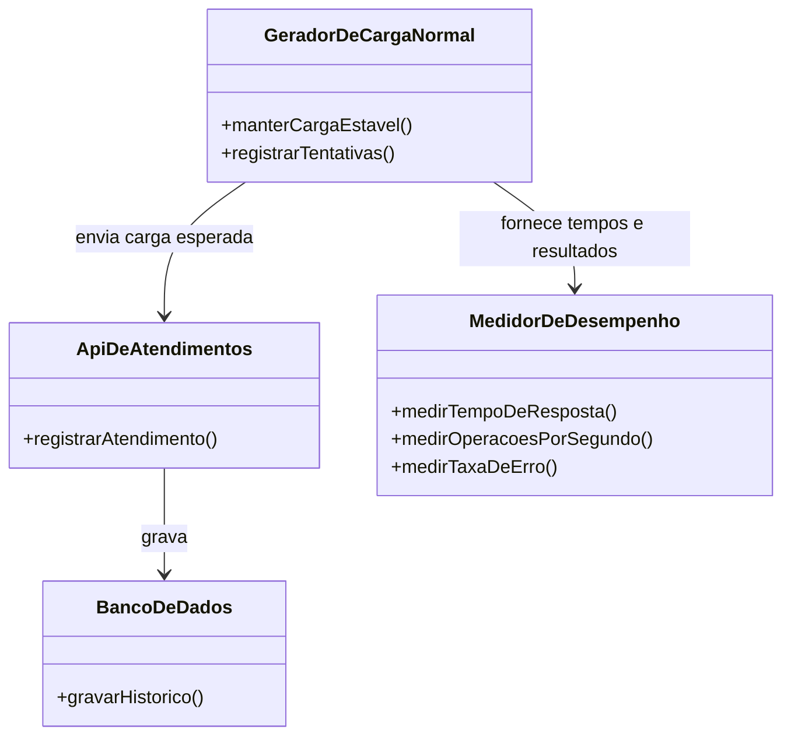

O teste mantém uma carga normal e mede tempo de resposta, quantidade de operações concluídas e erros. Diferentemente do estresse, ele não procura quebrar o sistema. Os valores aceitáveis devem ser definidos antes da execução; este estudo não inventa uma meta. Fontes: [`Mermaid`](diagramas/4.4-desempenho.mmd) e [`PlantUML`](diagramas/4.4-desempenho.puml).

---

## 6. Resumo

O estudo aplica diferentes estratégias de teste ao mesmo fluxo de prospecção: o registro do resultado de uma tentativa de contato. O teste de unidade isola a classificação do resultado, enquanto os testes de integração verificam a comunicação entre tela, API, serviço, repositório e banco de dados. As abordagens descendente e ascendente usam, respectivamente, um simulador e um acionador de teste.

Os testes de fumaça e regressão protegem o funcionamento básico e os comportamentos já existentes. Os testes de aceitação, Alfa e Beta avaliam a função com participação humana em diferentes ambientes. Por fim, os testes de sistema verificam recuperação após falha, controle de acesso, comportamento sob carga crescente e desempenho durante a carga normal.

---

## 7. Checklist da atividade

- [x] Apenas o setor de prospecção foi utilizado.
- [x] Apenas a função de registrar tentativa de contato foi aprofundada.
- [x] Os 13 tipos ou abordagens de teste possuem diagrama.
- [x] Os termos e fluxos estão em português e foram simplificados.
- [x] Os diagramas possuem versões Mermaid e PlantUML.
- [x] Aceitação, Alfa e Beta foram apresentados como validações humanas planejadas.

---

## 8. Referências

1. Pressman, R. S.; Maxim, B. R. *Engenharia de software: uma abordagem profissional*. 8. ed. Porto Alegre: AMGH, 2016.
2. Amaral, M. [Modelagem com Diagramas de Classes UML](https://maxwellamaral.github.io/lessons/softeng/design/uml_classes/).
3. [Documentação do Mermaid](https://mermaid.js.org/).
4. [Documentação do PlantUML](https://plantuml.com/).
