# Laboratório 02 — Estratégias e Níveis de Teste na Prática

## StreamPulse: plataforma de streaming VOD e transcodificação distribuída

**Disciplina:** Verificação, Validação e Teste de Software (VVTS)  
**Atividade:** Laboratório 02 — Estratégias e Níveis de Teste na Prática  
**Estudo de caso:** StreamPulse  
**Repositório:** [DiogoBAguiar/atividade-testes-software](https://github.com/DiogoBAguiar/atividade-testes-software)  
**Artefatos correlatos:** [`prompts_utilizados.md`](prompts_utilizados.md) · [`diagramas/`](diagramas/)

---

## Sumário

1. [Objetivo do laboratório](#1-objetivo-do-laboratório)
2. [Referencial conceitual](#2-referencial-conceitual)
3. [Arquitetura da StreamPulse](#3-arquitetura-da-streampulse)
4. [Nível 1 — Teste de unidade](#4-nível-1--teste-de-unidade)
5. [Nível 2 — Teste de integração](#5-nível-2--teste-de-integração)
6. [Nível 3 — Teste de validação](#6-nível-3--teste-de-validação)
7. [Nível 4 — Teste de sistema](#7-nível-4--teste-de-sistema)
8. [Síntese comparativa](#8-síntese-comparativa)
9. [Roteiro de defesa oral](#9-roteiro-de-defesa-oral)
10. [Conclusão](#10-conclusão)
11. [Referências](#11-referências)
12. [Estrutura do repositório](#12-estrutura-do-repositório)

---

## 1. Objetivo do laboratório

Este relatório materializa a **espiral de estratégia de teste** de Pressman e Maxim sobre um único produto: a StreamPulse. A escolha de um domínio coeso evita o vício de ilustrar unidade com uma calculadora escolar, integração com um e-commerce e sistema com um banco — prática que esconde o ponto da disciplina: **o mesmo sistema é exercitado em níveis diferentes, com oráculos diferentes**.

Para cada uma das treze abordagens exigidas, o texto responde três perguntas de engenharia:

1. **Onde** o componente vive na arquitetura (contexto).
2. **Como** o teste o aciona (mecânica: classes, métodos, mensagens).
3. **Que classe de defeito** se pretende revelar (não “aumentar a qualidade” em abstrato).

Os diagramas Mermaid são a notação de projeto; os arquivos em `diagramas/` são a fonte versionável. O GitHub renderiza os blocos nativos deste `README.md`.

---

## 2. Referencial conceitual

### 2.1 Cadeia causal: erro → defeito → falha

A disciplina adota o modelo causal (IEEE / ISO/IEC/IEEE 24765), e não a convenção temporal de Pressman no capítulo de revisões.

| Termo | O que é | Onde vive | Exemplo na StreamPulse |
| --- | --- | --- | --- |
| **Erro** | Ação ou decisão humana incorreta | mente / conversa / PR | Implementar `bitrateKbps > 50000` quando a regra é `> 50000` inválido, ou seja, o máximo **inclusivo** foi lido como exclusivo |
| **Defeito** (*fault*) | Manifestação do erro em um artefato | código, requisito, config, teste | `if bitrateKbps >= MAX` rejeita 50 Mbps válidos |
| **Falha** | Desvio observável do comportamento esperado | execução | Job de transcode 4K HDR LIVE recusado na véspera da estreia |

Um defeito pode permanecer **latente**: existe no artefato e só produz falha quando exercitado com determinada entrada, estado ou ambiente. Por isso teste não prova ausência de defeitos — reduz risco.

> Teste procura falhas. Depuração localiza o defeito, corrige o artefato e verifica se a correção não introduziu nova falha. São atividades distintas.

### 2.2 Verificação e validação (Boehm)

| Pergunta | Nome | Foco | Evidências típicas neste laboratório |
| --- | --- | --- | --- |
| Estamos construindo o **produto corretamente**? | Verificação | conformidade com especificação, contrato, modelo | 1.1, 2.1–2.5, 4.1–4.4 (oráculos técnicos) |
| Estamos construindo o **produto certo**? | Validação | adequação à necessidade do interessado | 3.1 UAT, 3.2 Alfa, 3.3 Beta |

Um módulo pode estar **verificado** (pro-rata arredonda com `HALF_EVEN`, JWT rejeita assinatura inválida) e ainda **não validado** (o usuário queria *pausar* a assinatura, não cancelar com reembolso). O inverso também ocorre: o PO aceita o fluxo (validação) enquanto um off-by-one no centavo permanece latente (verificação incompleta).

### 2.3 Estático e dinâmico

Este laboratório é predominantemente **dinâmico** (executa o SUT). A revisão dos próprios diagramas e deste texto é **V&V estático**. As duas se complementam: o diagrama 2.1 mostra, sem executar nada, que o Big Bang não isola causa-raiz; o caso pytest de 1.1 só existe depois que a regra de bitrate foi escrita de forma testável.

### 2.4 Espiral de Pressman aplicada à StreamPulse

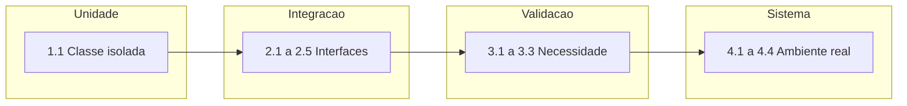

- **Unidade** parte do *código* (método, classe).
- **Integração** parte do *projeto* (interfaces, stubs, drivers).
- **Validação** parte dos *requisitos de usuário*.
- **Sistema** parte da *engenharia de sistemas* (Redis, CDN, carga, atacante).

### 2.5 SUT, stub e driver

| Papel | Definição operacional neste relatório |
| --- | --- |
| **SUT** | Artefato cujo comportamento está sob oráculo |
| **Stub** | Substitui um **servidor** ainda não pronto ou deliberadamente instável (responde a chamadas do SUT) |
| **Driver** | Substitui um **cliente** ainda não pronto (chama o SUT, fornece entrada, lê saída) |
| **Injeção de falha** | Estímulo deliberado ao ambiente (kill de processo, token adulterado, sobrecarga) |
| **Ator** | Pessoa ou sistema externo que dispara o cenário |
| **Ambiente** | Infraestrutura na qual o SUT executa |

Stub não é mock: o stub **habilita** a execução; o mock (quando usado) **verifica interações**. Os diagramas 2.2 e 2.3 usam stub e driver no sentido clássico de Pressman.

### 2.6 Convenção UML

Conforme a lição de diagrama de classes da disciplina:

- `+` público · `-` privado · `#` protegido
- `<<interface>>`, `<<service>>`, `<<enumeration>>`, `<<exception>>`
- atributos `nome : tipo`; métodos `nome(param : tipo) tipoRetorno`
- nomes de interface prefixados com `I`

---

## 3. Arquitetura da StreamPulse

A StreamPulse é um produto **genérico de prateleira** (assinatura B2C) com pipeline interno **sob encomenda** (transcodificação e CDN). O software, no sentido da apostila, não é só o binário do player: inclui manifesto HLS, chaves DRM, telemetria, runbooks e esta evidência de teste.

### 3.1 Visão de implantação (fluxo de mídia)

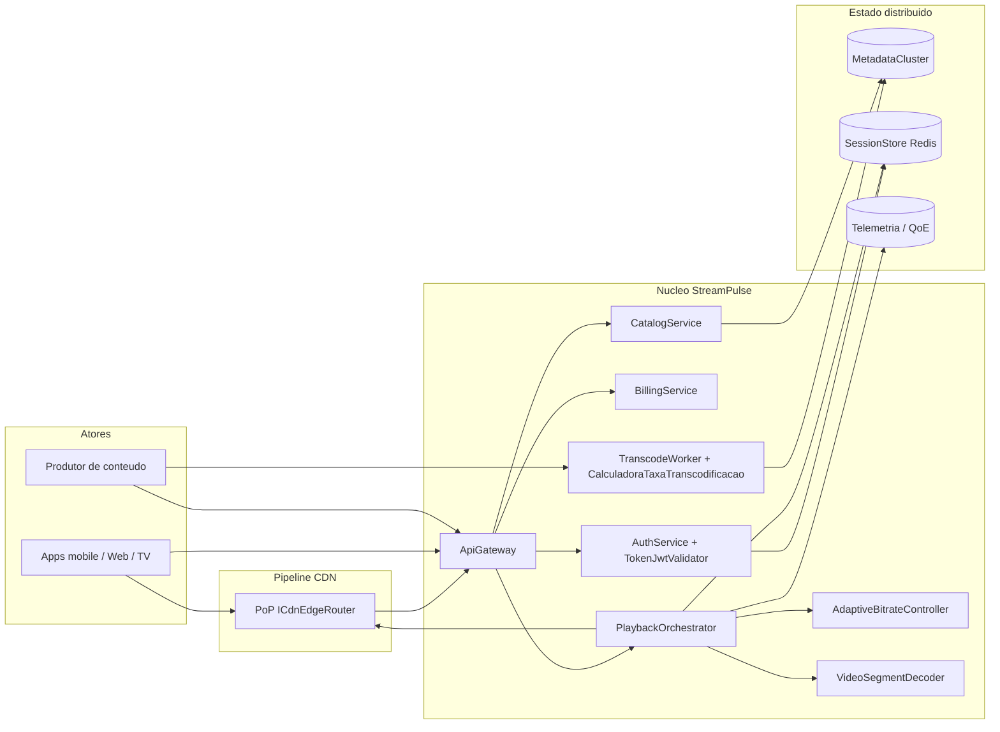

### 3.2 Visão lógica (contratos)

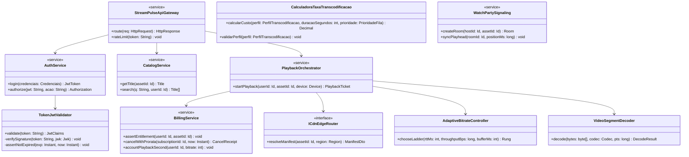

### 3.3 Mapa abordagem → SUT

| ID | Abordagem | SUT principal | Dublê / injeção |
| --- | --- | --- | --- |
| 1.1 | Unidade | `CalculadoraTaxaTranscodificacao` | driver pytest; sem stub |
| 2.1 | Big Bang | Auth + Catalog + Player + Billing | harness único |
| 2.2 | Top-down | `PlaybackOrchestrator` | `CdnEdgeRouterStub` |
| 2.3 | Bottom-up | `VideoSegmentDecoder` | `DecoderTestDriver` |
| 2.4 | Fumaça | rotas vitais do Gateway | job CI |
| 2.5 | Regressão | ABR + DRM + Billing | golden files |
| 3.1 | UAT | cancelamento pro-rata | oráculo do PO |
| 3.2 | Alfa | Watch Party em staging | engenheiros internos |
| 3.3 | Beta | app 2.4.0-beta em campo | 1.000 usuários reais |
| 4.1 | Recuperação | sessão Redis + playback | `kill -9` no primário |
| 4.2 | Segurança | Gateway + `TokenJwtValidator` + busca | JWT/payloads |
| 4.3 | Estresse | Gateway + circuit breaker | 500k VU |
| 4.4 | Desempenho | manifesto + chunks | carga a 80% da capacidade |

---

## 4. Nível 1 — Teste de unidade

O teste de unidade verifica a **menor unidade de projeto** em isolamento: lógica local, contornos e exceções. É verificação: compara o método com o contrato da classe, não com a satisfação do assinante.

### 1.1 Verificação de lógica atômica em componente/classe isolada

**Cenário:** suíte unitária da `CalculadoraTaxaTranscodificacao` (microsserviço de transcodificação), com análise de valores-limite e tratamento de exceções, sem I/O. O `TokenJwtValidator` permanece no módulo de autenticação e é exercitado no nível de sistema (4.2); aqui o SUT é a precificação do job, no mesmo espírito do `calcular_desconto` da apostila.

Fonte: [`diagramas/1.1-unidade-calculadora-taxa.mmd`](diagramas/1.1-unidade-calculadora-taxa.mmd)

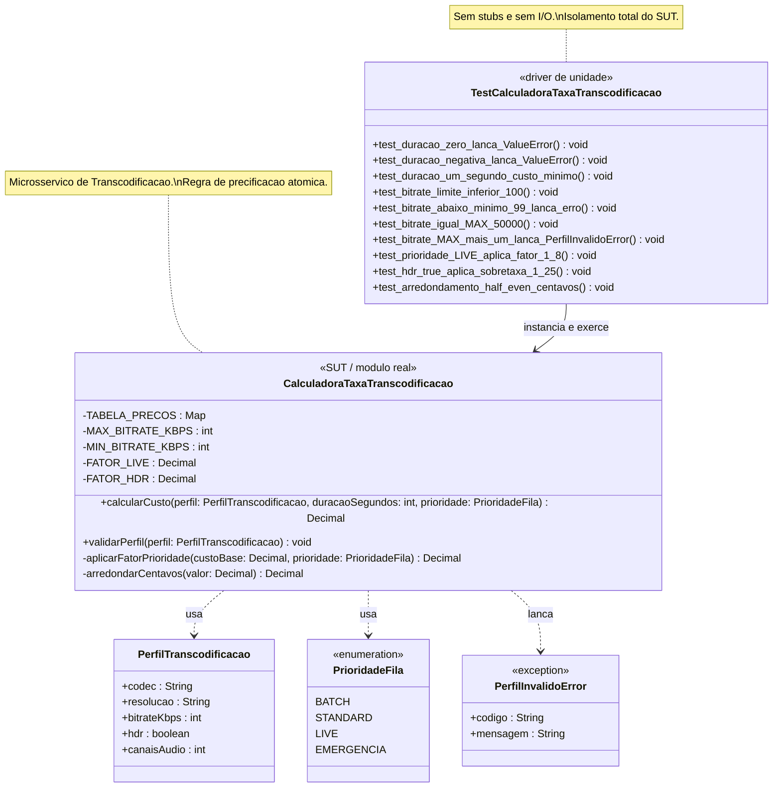

**Contexto arquitetural.** O `TranscodeWorker` cobra o produtor por minuto-perfil. A `CalculadoraTaxaTranscodificacao` é o núcleo puro dessa regra: recebe `PerfilTranscodificacao` (codec, resolução, `bitrateKbps`, `hdr`, `canaisAudio`), a duração em segundos e a `PrioridadeFila`. Não fala com fila, object storage nem faturamento persistente — por isso admite isolamento total. `TABELA_PRECOS`, `MIN_BITRATE_KBPS` (100) e `MAX_BITRATE_KBPS` (50 000) são constantes de classe, não consultas.

Contrato de precificação usado como oráculo:

- custo-base = (preço da resolução na tabela) × (duração em minutos) × (`bitrateKbps` / 1000);
- `aplicarFatorPrioridade`: `BATCH=0,6`, `STANDARD=1,0`, `LIVE=1,8`, `EMERGENCIA=2,5`;
- HDR verdadeiro multiplica por `FATOR_HDR=1,25`;
- `arredondarCentavos` usa *banker's rounding* (`HALF_EVEN`);
- `validarPerfil` lança `PerfilInvalidoError` fora da faixa de bitrate ou codec ∉ {H264, H265, AV1, VP9};
- `duracaoSegundos <= 0` lança `ValueError`.

**Mecânica do teste.** O driver `TestCalculadoraTaxaTranscodificacao` instancia o SUT e chama `calcularCusto` / `validarPerfil` sem dublês. A partição de contorno (Delamaro/Maldonado/Jino; eco do pytest da apostila) cobre:

- `test_duracao_zero_lanca_ValueError` e `test_duracao_negativa_lanca_ValueError` — fronteira esquerda da duração;
- `test_duracao_um_segundo_custo_minimo` — menor duração legal;
- `test_bitrate_limite_inferior_100` versus `test_bitrate_abaixo_minimo_99_lanca_erro` — inclusão de 100 kbps;
- `test_bitrate_igual_MAX_50000` versus `test_bitrate_MAX_mais_um_lanca_PerfilInvalidoError` — inclusão de 50 Mbps;
- `test_prioridade_LIVE_aplica_fator_1_8` — `aplicarFatorPrioridade` com `PrioridadeFila.LIVE`;
- `test_hdr_true_aplica_sobretaxa_1_25` — ramo booleano de HDR;
- `test_arredondamento_half_even_centavos` — 1,225 → 1,22 e 1,235 → 1,24.

**Objetivo e defeitos-alvo.** Revelar defeitos de **off-by-one** (`>` no lugar de `>=`), **operador invertido** na duração, **fator de prioridade não aplicado** (LIVE cobrado como STANDARD — prejuízo silencioso na estreia), **HDR ignorado**, **arredondamento half-up** incompatível com o ledger, e **exceção genérica** no lugar de `PerfilInvalidoError` (quebra o contrato com o worker).  

Cadeia: o engenheiro **erra** ao ler “até 50 Mbps” como exclusivo; o **defeito** é `if bitrateKbps >= 50000: raise`; a **falha** é o job 4K a 50 000 kbps recusado. Nenhum desses sintomas exige Redis.

---

## 5. Nível 2 — Teste de integração

O alvo muda: **interfaces, ordem de chamadas, dados compartilhados, temporização**. Um módulo unitariamente verde pode falhar ao cruzar a fronteira.

### 2.1 Integração não incremental (Big Bang)

**Cenário:** `AuthService`, `CatalogService`, `PlayerStreamer` e `BillingService` são ligados de uma só vez pelo `BigBangTestHarness`.

Fonte: [`diagramas/2.1-integracao-big-bang.mmd`](diagramas/2.1-integracao-big-bang.mmd)

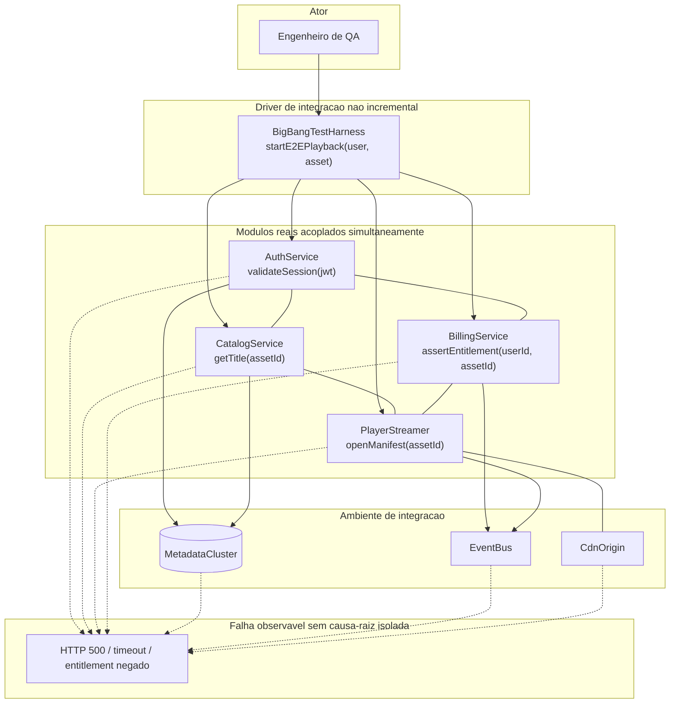

**Contexto arquitetural.** O caminho feliz de “play” atravessa autenticação, catálogo, direito de assistir e abertura de manifesto. No desenho de produção esses serviços já conversam via Gateway e EventBus. O Big Bang reproduz essa malha **sem** introduzir o sistema por fatias.

**Mecânica do teste.** O ator aciona `BigBangTestHarness.startE2EPlayback(user, asset)`. O harness chama, no mesmo processo de teste e na mesma janela temporal:

- `AuthService.validateSession(jwt)`;
- `CatalogService.getTitle(assetId)`;
- `BillingService.assertEntitlement(userId, assetId)`;
- `PlayerStreamer.openManifest(assetId)` contra `CdnOrigin`.

`MetadataCluster` e `EventBus` entram como ambiente compartilhado (sessão, título, evento `PlaybackStarted`). Não há stub: qualquer 500, timeout ou “entitlement negado” pode ter nascido em **qualquer** caixa do diagrama — daí as arestas pontilhadas para o mesmo sintoma `F`.

**Objetivo e defeitos-alvo.** Expor **incompatibilidade de contrato** (`Title` sem `drmKid` que `PlayerStreamer` assume obrigatório), **efeito colateral em dado global** (EventBus com schema `user_id` versus `userId`), **ordem implícita** (play antes do entitlement) e **timeouts cruzados**.  

O defeito pedagógico do próprio método: a **falha** é barata de observar e cara de diagnosticar. O erro humano típico é “integramos no fim do sprint”; o defeito é a ausência de incrementos; a falha é um 500 opaco na véspera da demo. Por isso o Big Bang aparece neste laboratório como **contraponto**, não como estratégia recomendada para a StreamPulse.

### 2.2 Integração incremental top-down (descendente) com stubs

**Cenário:** `PlaybackOrchestrator` (topo) integra-se a `ICdnEdgeRouter`, implementada nesta rodada por `CdnEdgeRouterStub` (latência de borda e 404 sem CDN real).

Fonte: [`diagramas/2.2-integracao-top-down-stubs.mmd`](diagramas/2.2-integracao-top-down-stubs.mmd)

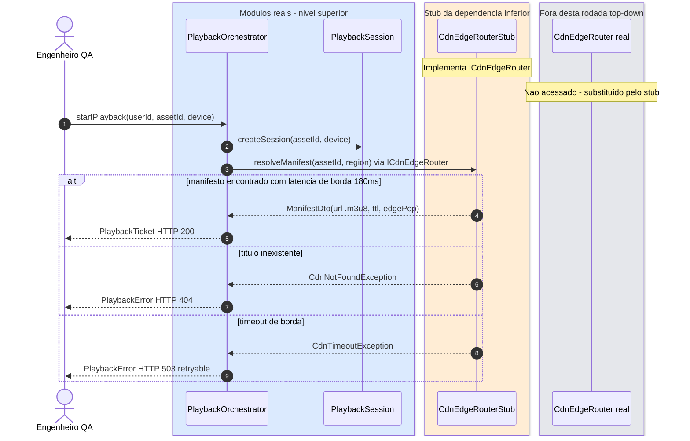

**Contexto arquitetural.** O `PlaybackOrchestrator` é o módulo de controle do play: autoriza, abre `PlaybackSession` e pede à borda o master `.m3u8`. A implementação real de `ICdnEdgeRouter` depende de PoPs, DNS e cache — cara, lenta e não determinística no início do incremento. O stub preserva o **contrato** e controla o relógio.

**Mecânica do teste.** O QA chama `startPlayback(userId, assetId, device)`. O orquestrador real executa `PlaybackSession.createSession` e, contra a interface `ICdnEdgeRouter.resolveManifest(assetId, region)`, atinge o `CdnEdgeRouterStub`. Três programações do stub:

1. atraso de 180 ms + `ManifestDto` → `PlaybackTicket` HTTP 200;
2. `CdnNotFoundException` → `PlaybackError` 404 (título que o catálogo ainda lista);
3. `CdnTimeoutException` → 503 *retryable* (o cliente pode repetir; o orquestrador não pode transformar timeout em 404).

O `CdnEdgeRouter` real permanece no box cinza: **não é chamado**.

**Objetivo e defeitos-alvo.** Revelar **mapeamento errado de exceção** (timeout virando 404 — player some o título), **sessão órfã** (`createSession` sem compensação no 503), **contrato de DTO** (`ttl` em segundos versus milissegundos) e **ausência de retryable**. O stub também revela se o topo **ignora** a interface e instancia a CDN concreta (quebra o teste ao exigir rede). Isso é incompatibilidade de tipo/dependência na fronteira, típica de integração descendente.

### 2.3 Integração incremental bottom-up (ascendente) com drivers

**Cenário:** `VideoSegmentDecoder` (baixo nível) é acionado por `DecoderTestDriver` antes de existirem player e UI.

Fonte: [`diagramas/2.3-integracao-bottom-up-drivers.mmd`](diagramas/2.3-integracao-bottom-up-drivers.mmd)

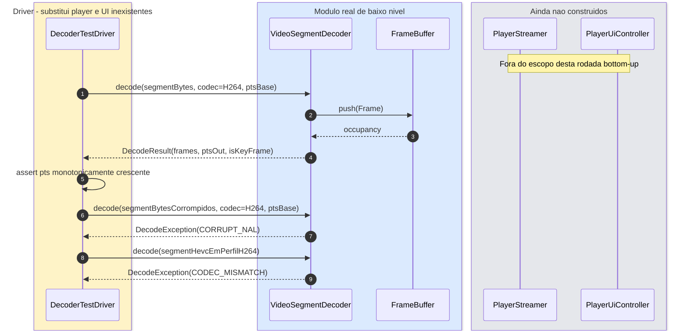

**Contexto arquitetural.** O decoder é a base da pilha de playback: transforma segmentos em `Frame`s no `FrameBuffer`. Sem ele, ABR, DRM e UI não têm o que mostrar. Construir de baixo para cima permite **congelar** o contrato `decode(bytes, codec, pts) → DecodeResult` antes do player existir.

**Mecânica do teste.** O `DecoderTestDriver` desempenha o papel que depois será de `PlayerStreamer.pumpBuffer()`: alimenta bytes, lê `DecodeResult` e aplica oráculos. `PlayerStreamer` e `PlayerUiController` aparecem apenas para tornar visível **o que o driver substitui**. Casos:

- segmento H.264 íntegro → `ptsOut` monotônico, `isKeyFrame` coerente com GOP;
- NAL corrompido → `DecodeException(CORRUPT_NAL)` (não segfault);
- bytes HEVC com `codec=H264` → `CODEC_MISMATCH` (não tentativa de interpretar NAL alheio).

**Objetivo e defeitos-alvo.** **Estouro de memória / buffer overflow** em NAL malformado, **race** se `FrameBuffer.push` não for seguro para o driver single-thread que depois virará multi-thread no player, **inversão de PTS** (seek quebrado), **silêncio em codec errado** (tela preta na UI futura). O erro típico é “o decoder assume bitstream confiável”; o defeito é ausência de validação; a falha só seria visível no player — o driver antecipa essa falha.

### 2.4 Teste de fumaça (Smoke Testing)

**Cenário:** pipeline de CI executa bateria **rápida e superficial** nas rotas vitais: login, master `.m3u8`, `/health`.

Fonte: [`diagramas/2.4-teste-fumaca.mmd`](diagramas/2.4-teste-fumaca.mmd)

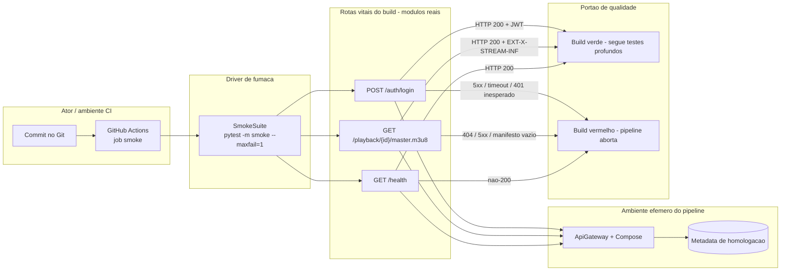

**Contexto arquitetural.** Após cada commit, a StreamPulse sobe um Compose efêmero (Gateway + metadados de homologação). A fumaça não substitui UAT nem carga: pergunta só se o **build está vivo** o bastante para justificar a suíte cara.

**Mecânica do teste.** `GitHub Actions` dispara `SmokeSuite` (`pytest -m smoke --maxfail=1`). Três estímulos, três oráculos:

| Rota | Oráculo mínimo |
| --- | --- |
| `POST /auth/login` | 200 e corpo com JWT |
| `GET /playback/{id}/master.m3u8` | 200 e `#EXT-X-STREAM-INF` |
| `GET /health` | 200 |

Qualquer desvio aborta o pipeline (`KO`). Não há assert de pro-rata, nem p95, nem Watch Party.

**Objetivo e defeitos-alvo.** **Build quebrado** (migração que derruba `/health`), **regressão grosseira de autenticação** (login 500), **manifesto vazio** após deploy de CDN de homologação, **timeout** por serviço que não subiu. É integração de *sanity*, não de profundidade. Confundi-la com teste de sistema é um erro de classificação: não há injeção de infra nem SLO.

### 2.5 Teste de regressão

**Cenário:** após refatorar `AdaptiveBitrateController.chooseLadder()`, a suíte reexecuta DRM e contabilização de consumo.

Fonte: [`diagramas/2.5-teste-regressao.mmd`](diagramas/2.5-teste-regressao.mmd)

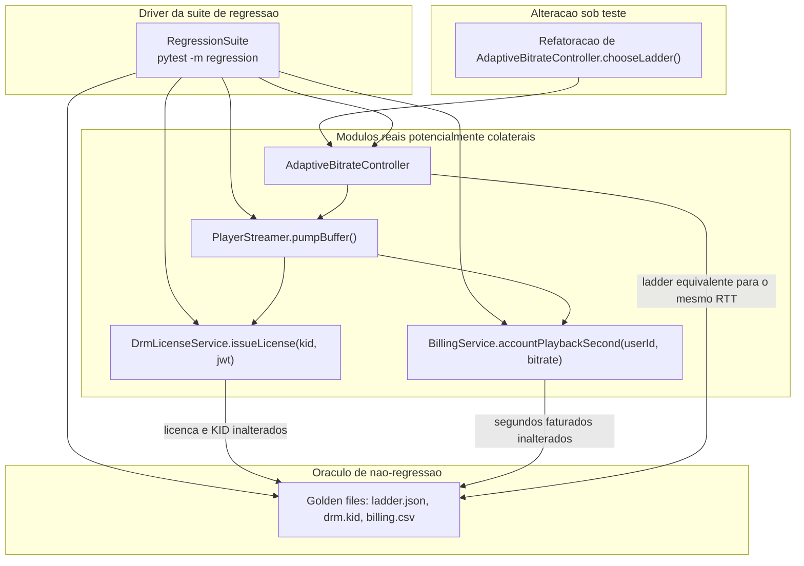

**Contexto arquitetural.** O ABR escolhe o degrau da ladder conforme RTT, *throughput* e buffer. Essa escolha dispara `PlayerStreamer.pumpBuffer()`, que pede licença DRM (`issueLicense(kid, jwt)`) e conta segundo assistido (`accountPlaybackSecond`). Uma refatoração “só interna” do ABR pode alterar a frequência de troca de rungs e, com ela, **faturamento e KID**.

**Mecânica do teste.** A `RegressionSuite` não reabre o debate de valores-limite do ABR (isso é unidade). Ela:

1. aplica o mesmo vetor de rede (`rttMs`, `throughputBps`, `bufferMs`) da *baseline*;
2. compara `chooseLadder()` a `ladder.json`;
3. executa `pumpBuffer()` e compara `drm.kid` e `billing.csv`.

**Objetivo e defeitos-alvo.** **Efeito colateral**: degrau mais alto aumenta bitrate faturado; troca excessiva de rungs martela `issueLicense` (throttling Widevine); KID errado após *repack*. A falha de regressão é “o play ainda funciona, a fatura não”. O erro humano é “refatorei sem suíte de vizinhança”; o defeito é acoplamento não testado entre ABR, DRM e billing.

---

## 6. Nível 3 — Teste de validação

Daqui em diante a pergunta dominante é a de Boehm: **estamos construindo o produto certo?** Os oráculos vêm de história de usuário, de funcionário em homologação e de usuário real em campo — não de cobertura de branches.

### 3.1 Critérios de aceitação (UAT)

**Cenário:** cancelamento de assinatura com reembolso pro-rata, em BDD, contra critério de negócio.

Fonte: [`diagramas/3.1-uat-aceitacao.mmd`](diagramas/3.1-uat-aceitacao.mmd)

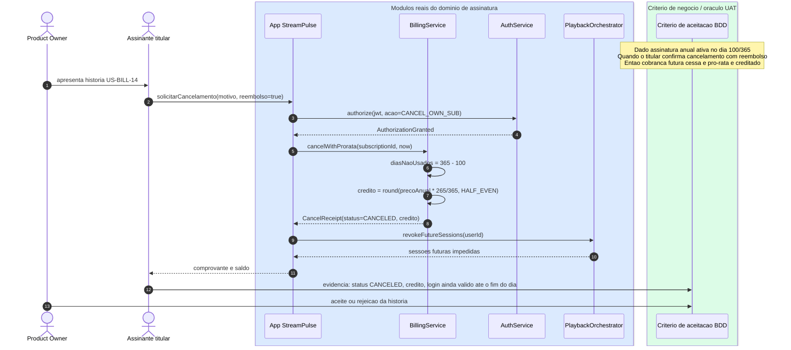

**Contexto arquitetural.** Assinatura e playback estão acoplados: cancelar implica `BillingService.cancelWithProrata` e `PlaybackOrchestrator.revokeFutureSessions`. A história **US-BILL-14** (titular cancela plano anual e recebe crédito dos dias não usados) é requisito de negócio, não detalhe de implementação.

**Mecânica do teste.** Formato BDD executado com o titular e o PO:

- **Dado** assinatura anual ativa no dia 100 de 365 e JWT do titular;
- **Quando** `solicitarCancelamento(motivo, reembolso=true)` e `AuthService.authorize(jwt, CANCEL_OWN_SUB)` concede;
- **Então** `cancelWithProrata` calcula `crédito = round(precoAnual * 265/365, HALF_EVEN)`, emite `CancelReceipt(status=CANCELED)`, revoga sessões futuras e **não** invalida o login no mesmo dia (regra de negócio explícita).

O PO aceita ou rejeita. Um teste unitário do arredondamento **verifica** a fórmula; o UAT **valida** se o produto que o titular vê (comprovante, saldo, “ainda posso terminar o episódio hoje?”) é o produto certo.

**Objetivo e defeitos-alvo.** **Requisito errado ou ambíguo** (pro-rata por mês comercial versus 365), **autorização quebrada** (titular cancelando conta de terceiros — aqui o UAT também denuncia falha de autorização se `CANCEL_OWN_SUB` estiver frouxo), **crédito não visível** no app, **sessões que continuam após cancelar**. A falha de validação típica: o sistema calcula certo e o comprovante diz “reembolso em até 30 dias” quando o critério era crédito imediato na carteira StreamPulse.

### 3.2 Teste Alfa

**Cenário:** módulo “Assista em Grupo” (Watch Party) em homologação, por funcionários e engenheiros.

Fonte: [`diagramas/3.2-teste-alfa.mmd`](diagramas/3.2-teste-alfa.mmd)

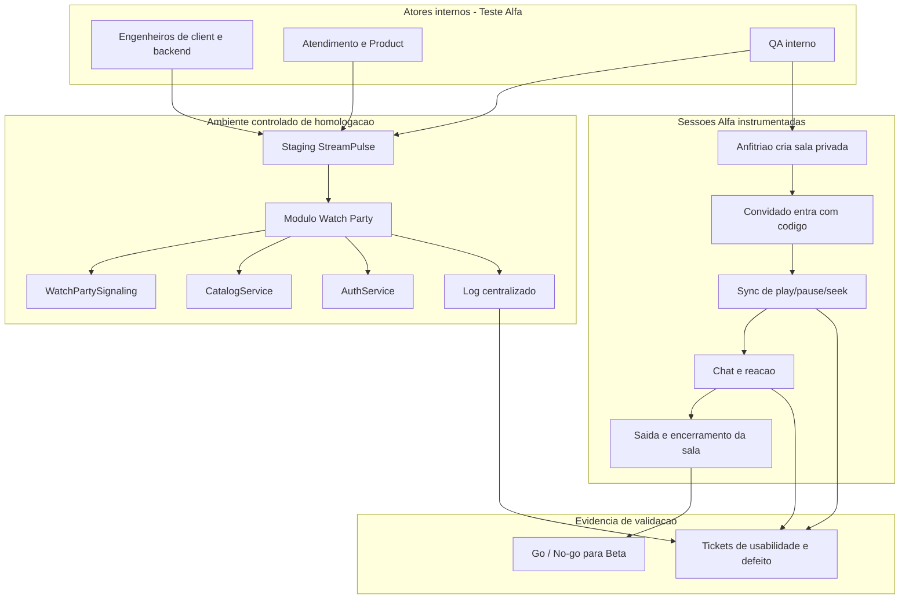

**Contexto arquitetural.** Watch Party acrescenta `WatchPartySignaling` (salas, *playhead* compartilhado) sobre catálogo e auth já existentes. É feature de **experiência**: mesmo com APIs verdes, o produto pode ser o errado (código de sala ilegível na TV, sync atrasado demais para comédia).

**Mecânica do teste.** Atores **internos** usam **staging**. O QA conduz H1–H5 com log centralizado. Não há usuários finais nem rede doméstica. A saída é go/no-go para Beta, não um p99.

**Objetivo e defeitos-alvo.** **Usabilidade** (convidado não acha o código na Smart TV), **sync drift** (`syncPlayhead` com relógio de cliente não NTP), **autorização de sala** (entrar sem convite), **vazamento de título** no chat. Alfa encontra falhas de *produto* ainda baratas de corrigir (custo de falha interna, CoQ).

### 3.3 Teste Beta

**Cenário:** versão experimental para 1.000 usuários reais em Android, iOS e Smart TVs, com telemetria de falhas em ambiente não controlado.

Fonte: [`diagramas/3.3-teste-beta.mmd`](diagramas/3.3-teste-beta.mmd)

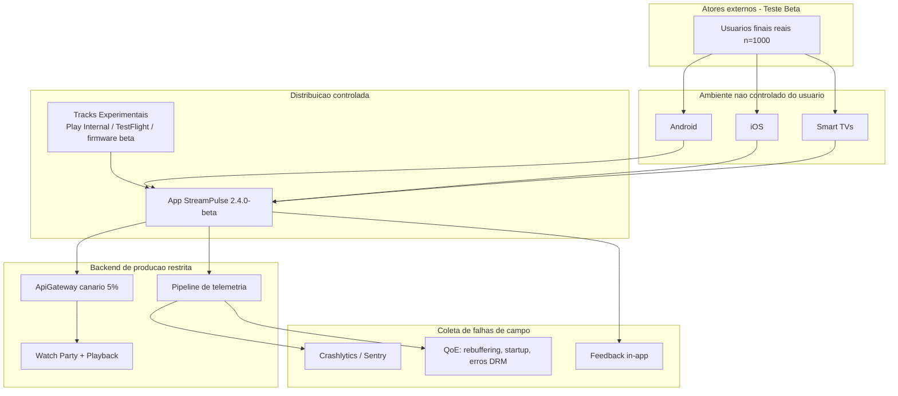

**Contexto arquitetural.** O mesmo Watch Party agora encontra NAT residencial, SoCs de TV, DRM de fabricante e redes 4G. O backend usa **canário 5%** no `ApiGateway` para limitar o raio de explosão. Telemetria (`TEL`) é parte do produto de software, não um extra.

**Mecânica do teste.** Distribuição controlada (`2.4.0-beta`) para mil contas opt-in. Não há roteiro H1–H5 obrigatório: o uso é o do dia a dia. Falhas chegam por crash, QoE (rebuffering, startup, DRM) e feedback. O ambiente **não** é o staging do Alfa.

**Objetivo e defeitos-alvo.** **Defeitos de campo** invisíveis no Alfa: Widevine L1 versus L3, *codec* da TV, IPv6, *clock skew* em TVs sem NTP, OOM em aparelhos 1 GB. A falha é o crash no sofá; o defeito pode ser um *assume* de laboratório; o erro foi validar só em homologação. Beta **não** substitui UAT: mil usuários podem “gostar” de um reembolso juridicamente errado.

---

## 7. Nível 4 — Teste de sistema

O software é exercitado **junto** de hardware, rede, dados e operadores. Os oráculos são de serviço: RTO, 401, degradação graciosa, p95.

### 4.1 Teste de recuperação (Recovery Testing)

**Cenário:** crash forçado (`kill -9`) do Redis primário de sessões durante streaming ativo; failover para réplica; persistência do ponto de reprodução.

Fonte: [`diagramas/4.1-recuperacao.mmd`](diagramas/4.1-recuperacao.mmd)

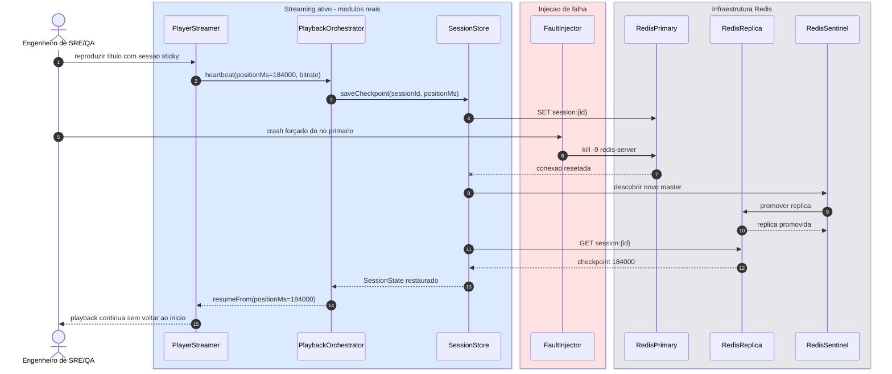

**Contexto arquitetural.** O *continue watching* vive no `SessionStore` Redis (primário + réplica + Sentinel). O `PlaybackOrchestrator` grava `saveCheckpoint(sessionId, positionMs)` a cada heartbeat do `PlayerStreamer`. Sem recuperação, um crash de Redis **reinicia o episódio** — falha de serviço, não de fórmula.

**Mecânica do teste.** Com o título em 184 000 ms, o `FaultInjector` envia `kill -9` ao processo do primário (SIGKILL: sem flush gracioso). O cliente Redis vê conexão resetada, consulta o Sentinel, a réplica é promovida, `GET session:{id}` devolve o checkpoint, `resumeFrom(positionMs=184000)` reancora o player. Oráculos: RTO abaixo do acordado (ex.: 10 s) e **posição não zerada**.

**Objetivo e defeitos-alvo.** **Falha de failover** (Sentinel sem quorum), **perda de writes** (checkpoint só em memória do primário), **split-brain**, **retomada no byte 0**, **tempestade de reconexão** do player. Cadeia: erro de arquitetura “Redis é cache, não precisa réplica”; defeito na implantação; falha = milhares de usuários voltando ao recap da série.

### 4.2 Teste de segurança (Security Testing)

**Cenário:** JWT expirado ou manipulado e payloads maliciosos na busca do catálogo; conformidade com o espírito OWASP API (quebra de autenticação, injeção, falha de autorização). O desenho abaixo é **oráculo de teste**, não receita de ataque.

Fonte: [`diagramas/4.2-seguranca.mmd`](diagramas/4.2-seguranca.mmd)

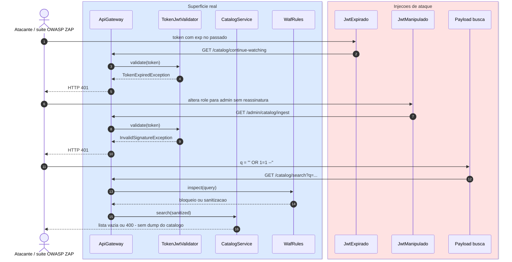

**Contexto arquitetural.** O Gateway é a superfície. `TokenJwtValidator.validate` verifica assinatura (`verifySignature`) e expiração (`assertNotExpired`). `CatalogService.search(q, userId)` não deve interpolar `q` em consulta. WAF é defesa em profundidade, não desculpa para SQL concatenado.

**Mecânica do teste.** Três estímulos controlados da suíte de segurança:

1. token com `exp` no passado → `TokenExpiredException` → **401** (não 200 com lista vazia);
2. *claim* `role=admin` alterada **sem** nova assinatura → `InvalidSignatureException` → **401** em `/admin/catalog/ingest`;
3. `q` com metacaracteres de injeção → WAF e/ou query parametrizada → **400 ou lista vazia**, jamais dump do catálogo.

**Objetivo e defeitos-alvo.** **Quebra de autenticação** (expirado aceito), **quebra de autorização** (role adulterada aceita — API1/API5), **injeção** na busca (API8), **mensagem 500 com stack** (vazamento).  

A apostila recorda: não existe software 100% seguro. Este teste **reduz risco**; um 401 nos três casos não prova ausência de outras classes (IDOR em `assetId`, replay de token ainda válido, etc.).

### 4.3 Teste de estresse (Stress Testing)

**Cenário:** 500 000 requisições simultâneas na estreia ao vivo, acima da capacidade nominal de 100 000 req/s; degradação graciosa (circuit breaker e throttling) em vez de colapso.

Fonte: [`diagramas/4.3-estresse.mmd`](diagramas/4.3-estresse.mmd)

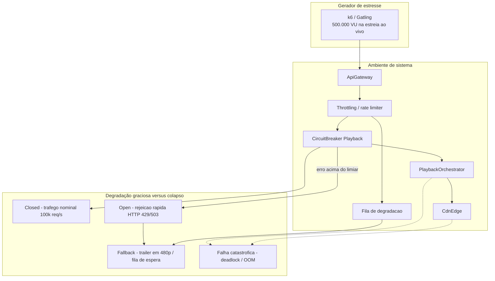

**Contexto arquitetural.** A estreia é o pior dia do ano: o envelope nominal (100k req/s) é ultrapassado por um fator cinco. Circuit breaker no playback e rate limiter no Gateway são **requisitos de sistema**, não otimizações.

**Mecânica do teste.** k6/Gatling sobe a 500k VU. Observa-se:

- `Closed` enquanto o erro está abaixo do limiar;
- `Open` com **rejeição rápida** 429/503 (não timeout de 30 s);
- fallback: fila ou trailer 480p;
- aresta pontilhada para `X`: OOM, deadlock, perda de writes de billing — **falha do teste de estresse**.

**Objetivo e defeitos-alvo.** **Ausência de backpressure**, **retry amplificado** (tempestade), **thread pool esgotado**, **circuit breaker que nunca abre** ou que **nunca fecha**, **faturamento inconsistente** sob perda de eventos. Distinção crítica: estresse pergunta “o que acontece **além** da capacidade?”; desempenho (4.4) pergunta “cabe no envelope com SLO?”.

### 4.4 Teste de desempenho (Performance Testing)

**Cenário:** p95 e p99 abaixo de 200 ms e vazão de chunks sob tráfego **operacional contínuo e estável**.

Fonte: [`diagramas/4.4-desempenho.mmd`](diagramas/4.4-desempenho.mmd)

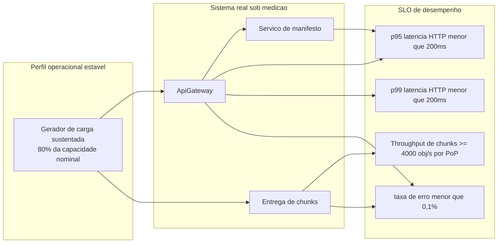

**Contexto arquitetural.** Fora da estreia, a StreamPulse vive em ~80% da capacidade. O SLO de *startup* e de manifesto (p95/p99 &lt; 200 ms) e a vazão de objetos no PoP são qualidade de **desempenho** (Garvin / ISO 25010), não de “aguentar o impossível”.

**Mecânica do teste.** Carga sustentada (não pico). Medem-se latências no Gateway e no serviço de manifesto, *throughput* de chunks no CDN, taxa de erro &lt; 0,1%. Não se injeta `kill -9` nem 500k VU.

**Objetivo e defeitos-alvo.** **Regressão de latência** (N+1 no catálogo antes do manifesto), **GC pauses** no Gateway, **PoP subdimensionado**, **p99 estourado** com p50 bonito (cauda — DRM, DNS, *cold cache*). A falha é o *spinner* de 3 s no controle remoto; o defeito pode ser uma query; o erro foi publicar sem envelope de carga.

---

## 8. Síntese comparativa

| ID | Nível | V ou V? | Dinâmico | Isola causa-raiz? | Oráculo principal |
| --- | --- | --- | --- | --- | --- |
| 1.1 | Unidade | Verificação | Sim | Alta | contrato da classe |
| 2.1 | Integração Big Bang | Verificação | Sim | **Baixa** | play ponta a ponta |
| 2.2 | Top-down | Verificação | Sim | Média-alta | HTTP + DTO do stub |
| 2.3 | Bottom-up | Verificação | Sim | Média-alta | `DecodeResult` / exceções |
| 2.4 | Fumaça | Verificação | Sim | Baixa (só vitais) | 200 nas três rotas |
| 2.5 | Regressão | Verificação | Sim | Média | golden files |
| 3.1 | UAT | **Validação** | Sim | Média | PO + BDD |
| 3.2 | Alfa | **Validação** | Sim | Média | go/no-go interno |
| 3.3 | Beta | **Validação** | Sim | Baixa (campo) | crash/QoE |
| 4.1 | Recuperação | Verificação de sistema | Sim | Média | posição + RTO |
| 4.2 | Segurança | Verificação de sistema | Sim | Média | 401 / sem dump |
| 4.3 | Estresse | Verificação de sistema | Sim | Média | 429/503 sem OOM |
| 4.4 | Desempenho | Verificação de sistema | Sim | Média | p95/p99/throughput |

**Quando o teste termina?** Nunca de forma absoluta (Pressman: o encargo passa ao usuário). Na StreamPulse, o encargo do Beta (3.3) e da operação (4.x) é contínuo; o laboratório termina quando há **evidência rastreável** para cada nível da espiral, não quando “não há mais bugs”.

---

## 9. Roteiro de defesa oral

Perguntas curtas que este artefato deve aguentar na lousa. Respostas em uma frase.

1. **Unidade com Redis ainda é unidade?** Não. Se `calcularCusto` consulta preço externo, o teste passou a ser integração.
2. **Big Bang é teste de sistema?** Não. Sistema inclui infra e tipos 4.x; Big Bang junta *módulos de software* de uma vez.
3. **Stub verifica chamadas?** Não necessariamente. Stub responde; mock (se houvesse) verificaria interações.
4. **Por que o player aparece em 2.3?** Para mostrar o cliente **ainda inexistente** que o driver substitui.
5. **Fumaça prova o reembolso?** Não. Prova que login, manifesto e health respondem.
6. **Regressão do ABR por que toca DRM?** Porque `pumpBuffer()` acopla ladder, licença e segundo faturado.
7. **UAT verde implica código correto?** Não. Valida a necessidade; a fórmula ainda pode ter defeito latente.
8. **Alfa em produção com funcionários é Beta?** Não. Beta é ambiente e dispositivo do usuário final.
9. **Telemetria de Beta substitui critério de aceite?** Não. Campo revela falha; aceite define o produto certo.
10. **`kill -9` é caos aleatório?** Não. É injeção planejada com oráculo de checkpoint.
11. **401 nos três casos de 4.2 prova segurança?** Não. Reduz risco nas classes exercitadas.
12. **Estresse = desempenho com mais usuários?** Não. Estresse vai **além** da capacidade; desempenho mede o envelope.
13. **Erro, defeito e falha no failover Redis?** Erro: tratar Redis como descartável. Defeito: checkpoint só no primário. Falha: episódio recomeça.

---

## 10. Conclusão

A StreamPulse permite percorrer a espiral sem trocar de metáfora. A **verificação** constrói confiança de que contratos, interfaces e infraestrutura se comportam como especificados (1.1, 2.x, 4.x). A **validação** constrói confiança de que cancelamento, Watch Party e o app no sofá são o produto que o interessado pediu (3.x). Stubs e drivers tornam o incremento honesto; Big Bang mostra o custo de não ser incremental; fumaça e regressão protegem o *build*; recuperação, segurança, estresse e desempenho recusam a fantasia do sistema que “já passou nos unitários”.

Publicam-se, junto a este relatório, os treze `.mmd` e o registro de prompts — porque em VVTS o artefato inclui a **rastreabilidade da evidência**, não só o desenho bonito.

---

## 11. Referências

1. R. S. Pressman e B. R. Maxim, *Engenharia de software: uma abordagem profissional*, 8ª ed., Porto Alegre: AMGH, 2016.
2. B. W. Boehm, “Verifying and validating software requirements and design specifications,” *IEEE Software*, 1984 (critério “produto certo / produto corretamente”).
3. M. E. Delamaro, J. C. Maldonado e M. Jino, *Introdução ao teste de software*, Rio de Janeiro: Elsevier, 2007.
4. IEEE Std 610.12 / ISO/IEC/IEEE 24765 — vocabulário (erro, *fault*, falha).
5. ISO/IEC 25010 — qualidade de produto (desempenho, confiabilidade, segurança).
6. OWASP API Security Top 10 — classificação de riscos de API (autenticação, injeção, autorização).
7. M. Amaral, *Apostila da disciplina: Verificação, Validação e Testes de Software* (notas de aula, 2026-07-30).
8. M. Anderson, *Diagrama de classes* (maxclass_it) — visibilidade UML, interfaces e relacionamentos.
9. B. Schneier, “Security Pitfalls in Cryptography,” 1998 — segurança como processo, não produto acabado.

---

## 12. Estrutura do repositório

```text
atividade-testes-software/
├── README.md                 # este relatório (Mermaid nativo)
├── prompts_utilizados.md     # metodologia PCIC e prompts reais
└── diagramas/
    ├── 1.1-unidade-calculadora-taxa.mmd
    ├── 2.1-integracao-big-bang.mmd
    ├── 2.2-integracao-top-down-stubs.mmd
    ├── 2.3-integracao-bottom-up-drivers.mmd
    ├── 2.4-teste-fumaca.mmd
    ├── 2.5-teste-regressao.mmd
    ├── 3.1-uat-aceitacao.mmd
    ├── 3.2-teste-alfa.mmd
    ├── 3.3-teste-beta.mmd
    ├── 4.1-recuperacao.mmd
    ├── 4.2-seguranca.mmd
    ├── 4.3-estresse.mmd
    └── 4.4-desempenho.mmd
```

Para republicar no GitHub, versione estes três caminhos na raiz do repositório `DiogoBAguiar/atividade-testes-software`. Os `.mmd` abrem no [Mermaid Live Editor](https://mermaid.live) se for preciso exportar SVG para a apresentação da banca.
